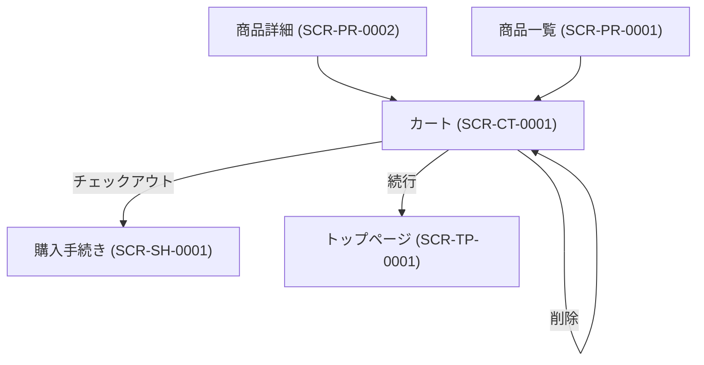

# 画面設計書

---

## ドキュメント情報

| 項目 | 内容 |
|------|------|
| ドキュメントID | SCR-CT-0001 |
| 対象機能 | カート |
| 作成日 | 2026-04-11 |
| 作成者 | ※要確認 |
| 最終更新日 | 2026-04-11 |
| 版数 | 1.0 |
| 承認者 | ※要確認 |

---

## 画面遷移図

---

## 画面詳細定義

### カート（画面ID：SCR-CT-0001）

#### 画面概要

| 項目 | 内容 |
|------|------|
| 画面名 | カート |
| 画面ID | SCR-CT-0001 |
| URL/パス | /cart |
| ルート名 | cart |
| コントローラー | CartController#index |
| テンプレート | Cart/index.twig |
| アクセス権限 | 全ユーザー（ゲスト含む） ※推測 |
| 前画面 | 商品一覧 (SCR-PR-0001)、商品詳細 (SCR-PR-0002) |
| 次画面 | 購入手続き (SCR-SH-0001) |

#### 表示項目定義

| # | 項目ID | 項目名 | 種別 | 参照テーブル/カラム | 表示条件 | 備考 |
|---|--------|--------|------|-------------------|---------|------|
| 1 | PROGRESS | 進捗インジケーター | 表示 | — | 常時 | カート→顧客情報→注文→確認→完了の5段階 |
| 2 | PRODUCT_IMAGE | 商品画像 | 表示 | product_image.file_name | 常時 | |
| 3 | PRODUCT_NAME | 商品名 | 表示 | product.name | 常時 | リンク |
| 4 | CLASS_CATEGORY1 | 規格1 | 表示 | class_category.name | 規格あり商品のみ | |
| 5 | CLASS_CATEGORY2 | 規格2 | 表示 | class_category.name | 規格2あり商品のみ | |
| 6 | UNIT_PRICE | 単価 | 表示 | product_class.price02_inc_tax ※推測 | 常時 | |
| 7 | QUANTITY | 数量 | 入力 | cart_item.quantity ※推測 | 常時 | 増減ボタン付き |
| 8 | SUBTOTAL | 小計 | 表示 | — | 常時 | |
| 9 | CART_TOTAL | カート合計 | 表示 | cart.total_price | 常時 | |
| 10 | GRAND_TOTAL | 総合計 | 表示 | — | 常時 | |
| 11 | FREE_SHIPPING_NOTICE | 送料無料条件 | 表示 | — | 設定時 | 金額・数量ベース |
| 12 | EMPTY_CART_MSG | カートが空メッセージ | 表示 | — | カート空時 | 警告表示 |
| 13 | MULTI_CART_NOTICE | 複数カート注意メッセージ | 表示 | — | 複数カート時 | ※推測 |

#### ボタン定義

| ボタン名 | 処理内容 | 遷移先 | 表示条件 |
|---------|---------|--------|---------|
| 削除 | PUT /cart/remove/{productClassId} | 同画面（再表示） | 常時 |
| 数量減 | PUT /cart/down/{productClassId} | 同画面（再表示） | 数量が1以上のみ表示 |
| 数量増 | PUT /cart/up/{productClassId} | 同画面（再表示） | 常時 |
| チェックアウト | GET /cart/buystep/{cart_key} | 購入手続き (SCR-SH-0001) | 常時 |
| 続行（買い物を続ける） | ホームページへリンク | トップページ (SCR-TP-0001) | 常時 |

#### エラーメッセージ定義

| エラーコード | 発生条件 | 表示メッセージ |
|------------|---------|-------------|
| ※要確認 | カートが空 | front.cart.no_items （翻訳キー） |
| ※要確認 | 在庫不足 | ※要確認 |

---

## 変更履歴

| 版数 | 変更日 | 変更者 | 変更内容 |
|------|--------|--------|---------|
| 1.0 | 2026-04-11 | ※要確認 | 初版作成（ec-cube/ec-cube 4.3ブランチよりリバース） |
