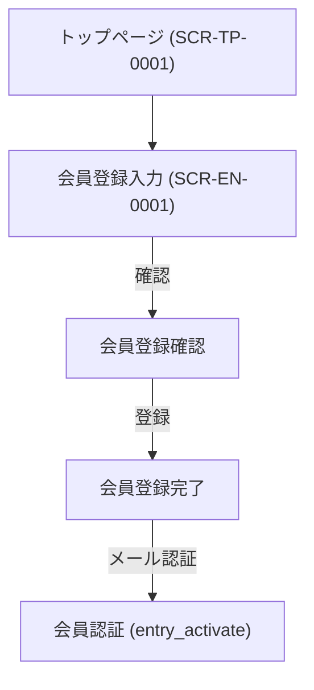

# 画面設計書

---

## ドキュメント情報

| 項目 | 内容 |
|------|------|
| ドキュメントID | SCR-EN-0001 |
| 対象機能 | 会員登録 |
| 作成日 | 2026-04-11 |
| 作成者 | ※要確認 |
| 最終更新日 | 2026-04-11 |
| 版数 | 1.0 |
| 承認者 | ※要確認 |

---

## 画面遷移図

---

## 画面詳細定義

### 会員登録（画面ID：SCR-EN-0001）

#### 画面概要

| 項目 | 内容 |
|------|------|
| 画面名 | 会員登録 |
| 画面ID | SCR-EN-0001 |
| URL/パス | /entry |
| ルート名 | entry / entry_confirm / entry_complete / entry_activate |
| コントローラー | EntryController#index / #complete / #activate |
| テンプレート | Entry/index.twig / Entry/confirm.twig / Entry/complete.twig / Entry/activate.twig |
| アクセス権限 | 未ログインユーザー ※推測 |
| 前画面 | トップページ (SCR-TP-0001) |
| 次画面 | マイページTOP (SCR-MP-0001) |

> ※実装メモ：`index`アクションはGET/POST両対応で、リクエストモード（confirm/complete）に応じてテンプレートを切り替える

#### 表示項目定義

| # | 項目ID | 項目名 | 種別 | 参照テーブル/カラム | 表示条件 | 備考 |
|---|--------|--------|------|-------------------|---------|------|
| 1 | NAME01 | 姓 | 入力 | customer.name01 | 常時 | ※推測 |
| 2 | NAME02 | 名 | 入力 | customer.name02 | 常時 | ※推測 |
| 3 | KANA01 | セイ | 入力 | customer.kana01 | 常時 | ※推測 |
| 4 | KANA02 | メイ | 入力 | customer.kana02 | 常時 | ※推測 |
| 5 | POSTAL_CODE | 郵便番号 | 入力 | customer.postal_code | 常時 | ※推測 |
| 6 | PREF | 都道府県 | 選択 | customer.pref_id | 常時 | ※推測 |
| 7 | ADDR01 | 住所1 | 入力 | customer.addr01 | 常時 | ※推測 |
| 8 | ADDR02 | 住所2 | 入力 | customer.addr02 | 常時 | ※推測 |
| 9 | PHONE | 電話番号 | 入力 | customer.phone_number | 常時 | ※推測 |
| 10 | EMAIL | メールアドレス | 入力 | customer.email | 常時 | ※推測 |
| 11 | PASSWORD | パスワード | 入力 | customer.password | 常時 | ※推測 |
| 12 | BIRTH | 生年月日 | 入力 | customer.birth | 任意 | ※推測 |
| 13 | SEX | 性別 | 選択 | customer.sex_id | 任意 | ※推測 |

> ※要確認（EntryType（Formクラス）の実装を読んで確定させる必要あり）

#### ボタン定義

| ボタン名 | 処理内容 | 遷移先 | 表示条件 |
|---------|---------|--------|---------|
| 確認画面へ | フォームsubmit（mode=confirm） | Entry/confirm.twig | 入力画面 |
| 登録 | フォームsubmit（mode=complete） | Entry/complete.twig | 確認画面 |
| 戻る | — | Entry/index.twig | 確認画面 |

---

## 変更履歴

| 版数 | 変更日 | 変更者 | 変更内容 |
|------|--------|--------|---------|
| 1.0 | 2026-04-11 | ※要確認 | 初版作成（ec-cube/ec-cube 4.3ブランチよりリバース） |
