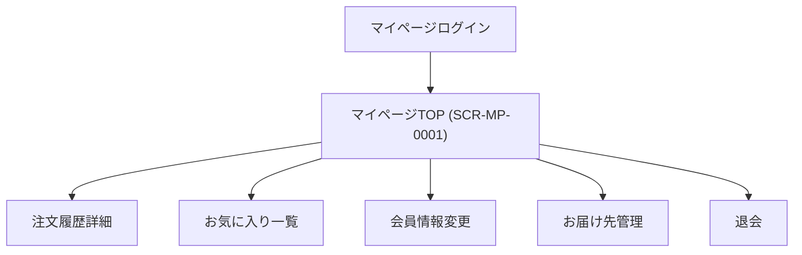

# 画面設計書

---

## ドキュメント情報

| 項目 | 内容 |
|------|------|
| ドキュメントID | SCR-MP-0001 |
| 対象機能 | マイページTOP |
| 作成日 | 2026-04-11 |
| 作成者 | ※要確認 |
| 最終更新日 | 2026-04-11 |
| 版数 | 1.0 |
| 承認者 | ※要確認 |

---

## 画面遷移図

---

## 画面詳細定義

### マイページTOP（画面ID：SCR-MP-0001）

#### 画面概要

| 項目 | 内容 |
|------|------|
| 画面名 | マイページTOP |
| 画面ID | SCR-MP-0001 |
| URL/パス | /mypage/ |
| ルート名 | mypage |
| コントローラー | Mypage\MypageController#index |
| テンプレート | Mypage/index.twig |
| アクセス権限 | 会員（ログイン必須） ※推測 |
| 前画面 | マイページログイン (mypage_login) |
| 次画面 | 注文履歴詳細、お気に入り一覧、会員情報変更、お届け先管理、退会 |

#### 関連ルート一覧

| ルート名 | URLパス | 画面 |
|---------|--------|------|
| mypage_login | /mypage/login | マイページログイン |
| mypage | /mypage/ | マイページTOP（本画面） |
| mypage_history | /mypage/history/{order_no} | 注文履歴詳細 |
| mypage_order | /mypage/order/{order_no} | 注文再購入処理（リダイレクト） |
| mypage_favorite | /mypage/favorite | お気に入り一覧 |
| mypage_favorite_delete | /mypage/favorite/{id}/delete | お気に入り削除処理（リダイレクト） |

#### 表示項目定義

| # | 項目ID | 項目名 | 種別 | 参照テーブル/カラム | 表示条件 | 備考 |
|---|--------|--------|------|-------------------|---------|------|
| 1 | CUSTOMER_NAME | 会員氏名 | 表示 | customer.name01/name02 ※推測 | 常時 | ※推測 |
| 2 | ORDER_HISTORY_LIST | 注文履歴一覧 | 表示 | dtb_order ※推測 | 常時 | ※推測 |
| 3 | ORDER_NO | 注文番号 | 表示 | order.order_no ※推測 | 履歴あり | 詳細へリンク |
| 4 | ORDER_DATE | 注文日 | 表示 | order.order_date ※推測 | 履歴あり | ※推測 |
| 5 | ORDER_STATUS | 注文ステータス | 表示 | order.order_status_id ※推測 | 履歴あり | ※推測 |

> ※要確認（Mypage/index.twigの実装を個別に確認していないため、詳細項目は標準的なマイページから推測）

#### ボタン定義

| ボタン名 | 処理内容 | 遷移先 | 表示条件 |
|---------|---------|--------|---------|
| 注文詳細 | GET /mypage/history/{order_no} | 注文履歴詳細 | 履歴あり |
| 再購入 | GET /mypage/order/{order_no} | カート（再購入処理後） | 履歴あり |
| お気に入り | GET /mypage/favorite | お気に入り一覧 | 常時 |

---

## 変更履歴

| 版数 | 変更日 | 変更者 | 変更内容 |
|------|--------|--------|---------|
| 1.0 | 2026-04-11 | ※要確認 | 初版作成（ec-cube/ec-cube 4.3ブランチよりリバース） |
