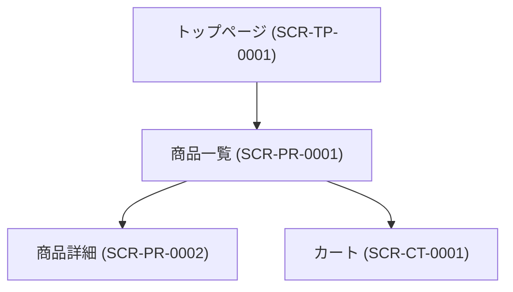

# 画面設計書

---

## ドキュメント情報

| 項目 | 内容 |
|------|------|
| ドキュメントID | SCR-PR-0001 |
| 対象機能 | 商品一覧 |
| 作成日 | 2026-04-11 |
| 作成者 | ※要確認 |
| 最終更新日 | 2026-04-11 |
| 版数 | 1.0 |
| 承認者 | ※要確認 |

---

## 画面遷移図

---

## 画面詳細定義

### 商品一覧（画面ID：SCR-PR-0001）

#### 画面概要

| 項目 | 内容 |
|------|------|
| 画面名 | 商品一覧 |
| 画面ID | SCR-PR-0001 |
| URL/パス | /products/list |
| コントローラー | ProductController#index |
| テンプレート | Product/list.twig |
| アクセス権限 | 全ユーザー（ゲスト含む） ※推測 |
| 前画面 | トップページ、カテゴリナビ等 ※推測 |
| 次画面 | 商品詳細 (SCR-PR-0002)、カート (SCR-CT-0001) |

#### 表示項目定義

| # | 項目ID | 項目名 | 種別 | 参照テーブル/カラム | 表示条件 | 備考 |
|---|--------|--------|------|-------------------|---------|------|
| 1 | SEARCH_KEYWORD | キーワード | 入力 | — | 常時 | パンくずにも反映 |
| 2 | CATEGORY | カテゴリ | 選択（hidden） | category.id | 常時 | category_idパラメータ |
| 3 | DISP_NUMBER | 表示件数 | 選択（ドロップダウン） | — | 常時 | |
| 4 | ORDER_BY | 並び順 | 選択（ドロップダウン） | — | 常時 | |
| 5 | PRODUCT_IMAGE | 商品画像 | 表示 | product_image.file_name | 常時 | 5件目以降はlazy loading |
| 6 | PRODUCT_NAME | 商品名 | 表示 | product.name | 常時 | 商品詳細へのリンク |
| 7 | PRODUCT_COMMENT | 商品説明 | 表示 | product.description_list ※推測 | 常時 | |
| 8 | PRODUCT_PRICE | 価格（税込） | 表示 | product_class.price02_inc_tax ※推測 | 常時 | 複数規格がある場合は範囲表示 |
| 9 | SEARCH_COUNT | 検索結果件数 | 表示 | — | 常時 | |
| 10 | PAGER | ページネーション | 表示 | — | 件数が表示件数を超える場合 | pager.twigをインクルード |
| 11 | ADD_CART_BTN | カートに追加ボタン | 選択/ボタン | — | 在庫あり | AJAX処理 |
| 12 | SOLD_OUT | 売り切れ表示 | 表示 | — | 在庫なし | ボタンdisabled |
| 13 | CLASS_CATEGORY1 | 規格1選択 | 選択（ドロップダウン） | class_category.name ※推測 | 規格あり商品のみ | |
| 14 | CLASS_CATEGORY2 | 規格2選択 | 選択（ドロップダウン） | class_category.name ※推測 | 規格あり商品のみ | |
| 15 | QUANTITY | 数量 | 入力 | — | 常時 | |

#### 入力バリデーション

| 項目ID | 項目名 | 必須 | 文字種 | 桁数 | その他制約 |
|--------|--------|------|--------|------|-----------|
| QUANTITY | 数量 | 必須 | 半角数字 | ※要確認 | 1以上の整数 ※推測 |

#### ボタン定義

| ボタン名 | 処理内容 | 遷移先 | 表示条件 |
|---------|---------|--------|---------|
| カートに追加 | AJAX: /products/add_cart/{id} | モーダル表示→カート (SCR-CT-0001) | 在庫あり |
| 表示件数変更 | フォームsubmit（disp_number変更） | 同画面（再検索） | 常時 |
| 並び順変更 | フォームsubmit（orderby変更） | 同画面（再検索） | 常時 |

#### モーダル定義

| モーダル名 | 表示条件 | 内容 |
|-----------|---------|------|
| カート追加完了モーダル | カート追加成功時 | 「買い物を続ける」「カートへ」ボタンを表示 |

#### エラーメッセージ定義

| エラーコード | 発生条件 | 表示メッセージ |
|------------|---------|-------------|
| ※要確認 | 在庫切れ等でカート追加不可 | ※要確認 |

---

## 変更履歴

| 版数 | 変更日 | 変更者 | 変更内容 |
|------|--------|--------|---------|
| 1.0 | 2026-04-11 | ※要確認 | 初版作成（ec-cube/ec-cube 4.3ブランチよりリバース） |
