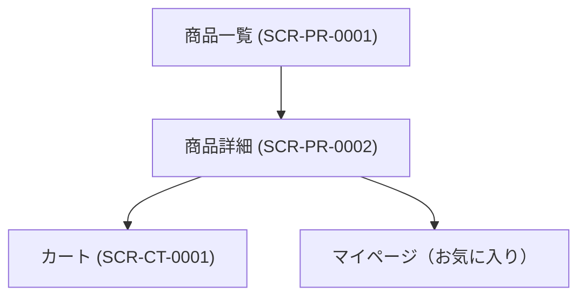

# 画面設計書

---

## ドキュメント情報

| 項目 | 内容 |
|------|------|
| ドキュメントID | SCR-PR-0002 |
| 対象機能 | 商品詳細 |
| 作成日 | 2026-04-11 |
| 作成者 | ※要確認 |
| 最終更新日 | 2026-04-11 |
| 版数 | 1.0 |
| 承認者 | ※要確認 |

---

## 画面遷移図

---

## 画面詳細定義

### 商品詳細（画面ID：SCR-PR-0002）

#### 画面概要

| 項目 | 内容 |
|------|------|
| 画面名 | 商品詳細 |
| 画面ID | SCR-PR-0002 |
| URL/パス | /products/detail/{id} |
| ルート名 | product_detail |
| コントローラー | ProductController#detail |
| テンプレート | Product/detail.twig |
| アクセス権限 | 全ユーザー（ゲスト含む） ※推測 |
| 前画面 | 商品一覧 (SCR-PR-0001) |
| 次画面 | カート (SCR-CT-0001) |

#### 表示項目定義

| # | 項目ID | 項目名 | 種別 | 参照テーブル/カラム | 表示条件 | 備考 |
|---|--------|--------|------|-------------------|---------|------|
| 1 | PRODUCT_IMAGE_MAIN | メイン画像スライダー | 表示 | product_image.file_name | 常時 | カルーセル表示 |
| 2 | PRODUCT_IMAGE_THUMB | サムネイル画像 | 表示 | product_image.file_name | 常時 | クリックで切り替え |
| 3 | PRODUCT_NAME | 商品名 | 表示 | product.name | 常時 | h2見出し |
| 4 | PRODUCT_TAGS | タグ | 表示 | product_tag ※推測 | タグ設定時 | |
| 5 | PRICE01 | 通常価格 | 表示 | product_class.price01 | 規格あり商品は最小〜最大を範囲表示 | |
| 6 | PRICE02 | 販売価格（税込） | 表示 | product_class.price02_inc_tax ※推測 | 常時 | 強調表示 |
| 7 | PRODUCT_CODE | 商品コード | 表示 | product_class.code | 常時 | |
| 8 | CATEGORY | 関連カテゴリ | 表示 | product_category → category | 常時 | パンくずリスト形式 |
| 9 | CLASS_CATEGORY1 | 規格1選択 | 選択（ドロップダウン） | class_category.name | 規格あり商品のみ | |
| 10 | CLASS_CATEGORY2 | 規格2選択 | 選択（ドロップダウン） | class_category.name | 規格あり商品のみ | |
| 11 | QUANTITY | 数量 | 入力 | — | 常時 | #quantity |
| 12 | DESCRIPTION | 商品説明 | 表示 | product.description_detail ※推測 | 常時 | |
| 13 | FREE_AREA | フリーエリア | 表示 | product.free_area ※推測 | 常時 | |
| 14 | STOCK_STATUS | 在庫状態 | 表示 | product_stock.stock ※推測 | 在庫なし時「品切れ」表示 | |

#### 入力バリデーション

| 項目ID | 項目名 | 必須 | 文字種 | 桁数 | その他制約 |
|--------|--------|------|--------|------|-----------|
| QUANTITY | 数量 | 必須 | 半角数字 | ※要確認 | 1以上の整数 ※推測 |
| CLASS_CATEGORY1 | 規格1 | 必須（規格あり商品） | — | — | — |
| CLASS_CATEGORY2 | 規格2 | 必須（規格2あり商品） | — | — | — |

#### ボタン定義

| ボタン名 | 処理内容 | 遷移先 | 表示条件 |
|---------|---------|--------|---------|
| カートに追加 | AJAX: /products/add_cart/{id} | モーダル表示→カート (SCR-CT-0001) | 在庫あり |
| お気に入り登録 | /products/add_favorite/{id} | 同画面 | ログイン済み ※推測 |

#### モーダル定義

| モーダル名 | 表示条件 | 内容 |
|-----------|---------|------|
| カート追加完了モーダル | カート追加成功時 | 「カートへ移動」ボタン |

---

## 変更履歴

| 版数 | 変更日 | 変更者 | 変更内容 |
|------|--------|--------|---------|
| 1.0 | 2026-04-11 | ※要確認 | 初版作成（ec-cube/ec-cube 4.3ブランチよりリバース） |
