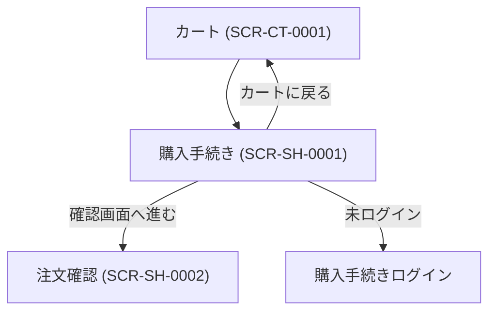

# 画面設計書

---

## ドキュメント情報

| 項目 | 内容 |
|------|------|
| ドキュメントID | SCR-SH-0001 |
| 対象機能 | 購入手続き |
| 作成日 | 2026-04-11 |
| 作成者 | ※要確認 |
| 最終更新日 | 2026-04-11 |
| 版数 | 1.0 |
| 承認者 | ※要確認 |

---

## 画面遷移図

---

## 画面詳細定義

### 購入手続き（画面ID：SCR-SH-0001）

#### 画面概要

| 項目 | 内容 |
|------|------|
| 画面名 | 購入手続き（お客様情報入力） |
| 画面ID | SCR-SH-0001 |
| URL/パス | /shopping |
| ルート名 | shopping |
| コントローラー | ShoppingController#index |
| テンプレート | Shopping/index.twig |
| アクセス権限 | 全ユーザー（ゲスト可） ※推測 |
| 前画面 | カート (SCR-CT-0001) |
| 次画面 | 注文確認 (SCR-SH-0002) |

#### 表示項目定義

**顧客情報セクション**

| # | 項目ID | 項目名 | 種別 | 参照テーブル/カラム | 表示条件 | 備考 |
|---|--------|--------|------|-------------------|---------|------|
| 1 | CUST_NAME | 氏名（姓・名） | 表示/入力 | customer.name01/name02 | 常時 | 非会員は入力 |
| 2 | CUST_KANA | フリガナ（姓・名） | 表示/入力 | customer.kana01/kana02 | 常時 | |
| 3 | CUST_COMPANY | 会社名 | 表示/入力 | customer.company_name | 常時 | |
| 4 | CUST_ZIP | 郵便番号 | 表示/入力 | customer.postal_code | 常時 | |
| 5 | CUST_PREF | 都道府県 | 表示/選択 | customer.pref_id | 常時 | |
| 6 | CUST_ADDR1 | 住所1 | 表示/入力 | customer.addr01 | 常時 | |
| 7 | CUST_ADDR2 | 住所2 | 表示/入力 | customer.addr02 | 常時 | |
| 8 | CUST_PHONE | 電話番号 | 表示/入力 | customer.phone_number | 常時 | |
| 9 | CUST_EMAIL | メールアドレス | 表示/入力 | customer.email | 常時 | |

**配送情報セクション**

| # | 項目ID | 項目名 | 種別 | 参照テーブル/カラム | 表示条件 | 備考 |
|---|--------|--------|------|-------------------|---------|------|
| 10 | SHIP_PRODUCT_LIST | 配送商品一覧 | 表示 | order_item ※推測 | 常時 | 画像・名称・数量・金額 |
| 11 | SHIP_ADDRESS | 配送先住所・氏名 | 表示 | shipping ※推測 | 常時 | |
| 12 | DELIVERY | 配送業者 | 選択 | delivery | 常時 | ドロップダウン |
| 13 | DELIVERY_DATE | 配送日時 | 選択 | — | 指定可能時 | |

**支払い情報セクション**

| # | 項目ID | 項目名 | 種別 | 参照テーブル/カラム | 表示条件 | 備考 |
|---|--------|--------|------|-------------------|---------|------|
| 14 | PAYMENT | 支払い方法 | 選択（ラジオ） | payment | 常時 | 画像表示あり |

**オプション**

| # | 項目ID | 項目名 | 種別 | 参照テーブル/カラム | 表示条件 | 備考 |
|---|--------|--------|------|-------------------|---------|------|
| 15 | USE_POINT | 使用ポイント | 入力 | customer.point ※推測 | 会員かつポイント利用可 | |
| 16 | MESSAGE | メッセージ | 入力（テキストエリア） | order.message ※推測 | 常時 | |
| 17 | TRADE_LAW | 特定商取引法情報 | 表示 | — | 有効時 | |

**金額サマリー**

| # | 項目ID | 項目名 | 種別 | 参照テーブル/カラム | 表示条件 | 備考 |
|---|--------|--------|------|-------------------|---------|------|
| 18 | SUBTOTAL | 小計 | 表示 | — | 常時 | |
| 19 | CHARGE | 手数料 | 表示 | — | 常時 | |
| 20 | DELIVERY_FEE | 配送料金 | 表示 | — | 常時 | |
| 21 | DISCOUNT | 割引額 | 表示 | — | 常時 | |
| 22 | TAX_BY_RATE | 税率別合計・税額 | 表示 | — | 常時 | |
| 23 | POINT_USE_EARN | ポイント使用/獲得 | 表示 | — | ポイント機能有効時 | |
| 24 | GRAND_TOTAL | 支払い総額 | 表示 | order.payment_total ※推測 | 常時 | |

#### ボタン定義

| ボタン名 | 処理内容 | 遷移先 | 表示条件 |
|---------|---------|--------|---------|
| 変更（顧客情報） | お客様情報編集 | ※要確認 | 非会員 |
| 変更（配送先） | /shopping/shipping_edit/{id} | 配送先編集 | 常時 |
| 確認画面へ進む | フォームsubmit → shopping_confirm | 注文確認 (SCR-SH-0002) | 常時 |
| カートに戻る | — | カート (SCR-CT-0001) | 常時 |

#### 入力バリデーション

※要確認（詳細なバリデーションはForm Type定義を参照）

---

## 変更履歴

| 版数 | 変更日 | 変更者 | 変更内容 |
|------|--------|--------|---------|
| 1.0 | 2026-04-11 | ※要確認 | 初版作成（ec-cube/ec-cube 4.3ブランチよりリバース） |
