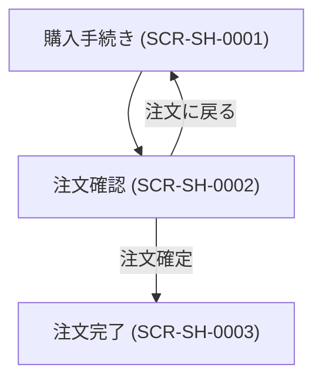

# 画面設計書

---

## ドキュメント情報

| 項目 | 内容 |
|------|------|
| ドキュメントID | SCR-SH-0002 |
| 対象機能 | 注文確認 |
| 作成日 | 2026-04-11 |
| 作成者 | ※要確認 |
| 最終更新日 | 2026-04-11 |
| 版数 | 1.0 |
| 承認者 | ※要確認 |

---

## 画面遷移図

---

## 画面詳細定義

### 注文確認（画面ID：SCR-SH-0002）

#### 画面概要

| 項目 | 内容 |
|------|------|
| 画面名 | 注文確認 |
| 画面ID | SCR-SH-0002 |
| URL/パス | /shopping/confirm |
| ルート名 | shopping_confirm |
| コントローラー | ShoppingController#confirm |
| テンプレート | Shopping/confirm.twig |
| アクセス権限 | 全ユーザー（ゲスト可） ※推測 |
| 前画面 | 購入手続き (SCR-SH-0001) |
| 次画面 | 注文完了 (SCR-SH-0003) |

#### 表示項目定義

| # | 項目ID | 項目名 | 種別 | 参照テーブル/カラム | 表示条件 | 備考 |
|---|--------|--------|------|-------------------|---------|------|
| 1 | CUST_INFO | 顧客情報 | 表示 | customer ※推測 | 常時 | 氏名・カナ・会社・郵便番号・住所・電話・メール |
| 2 | SHIP_PRODUCTS | 配送商品一覧 | 表示 | order_item | 常時 | 画像・名称・税率区分・価格×数量 |
| 3 | SHIP_ADDRESS | 配送先住所・氏名 | 表示 | shipping | 常時 | |
| 4 | DELIVERY | 配送業者 | 表示 | delivery | 常時 | |
| 5 | DELIVERY_FEE | 配送手数料 | 表示 | — | 常時 | |
| 6 | DELIVERY_DATE | 配送日時 | 表示 | — | 指定あり | |
| 7 | PAYMENT | 決済方法 | 表示 | payment | 常時 | |
| 8 | CHARGE | 手数料 | 表示 | — | 常時 | |
| 9 | USE_POINT | 使用ポイント | 表示 | — | ポイント機能有効時 | |
| 10 | MESSAGE | 注文メッセージ | 表示 | order.message ※推測 | 入力あり | |
| 11 | TRADE_LAW | 特定商取引法情報 | 表示 | — | 有効時 | |
| 12 | SUBTOTAL | 小計 | 表示 | — | 常時 | |
| 13 | DISCOUNT | 割引 | 表示 | — | 常時 | |
| 14 | TAX_BY_RATE | 税率別合計と税額 | 表示 | — | 常時 | |
| 15 | GRAND_TOTAL | 支払い総額 | 表示 | order.payment_total ※推測 | 常時 | |
| 16 | POINT_EARN | ポイント加算 | 表示 | — | ポイント機能有効時 | |

#### ボタン定義

| ボタン名 | 処理内容 | 遷移先 | 表示条件 |
|---------|---------|--------|---------|
| 注文確定 | POST /shopping/checkout | 注文完了 (SCR-SH-0003) | 常時 |
| 注文に戻る | — | 購入手続き (SCR-SH-0001) | 常時 |

---

## 変更履歴

| 版数 | 変更日 | 変更者 | 変更内容 |
|------|--------|--------|---------|
| 1.0 | 2026-04-11 | ※要確認 | 初版作成（ec-cube/ec-cube 4.3ブランチよりリバース） |
