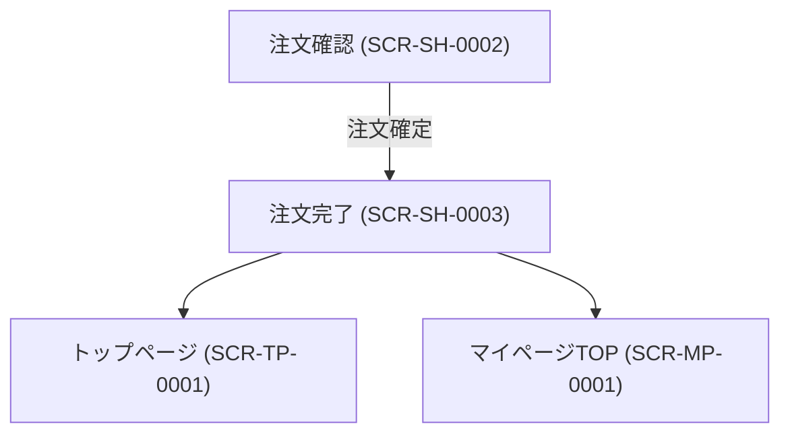

# 画面設計書

---

## ドキュメント情報

| 項目 | 内容 |
|------|------|
| ドキュメントID | SCR-SH-0003 |
| 対象機能 | 注文完了 |
| 作成日 | 2026-04-11 |
| 作成者 | ※要確認 |
| 最終更新日 | 2026-04-11 |
| 版数 | 1.0 |
| 承認者 | ※要確認 |

---

## 画面遷移図

---

## 画面詳細定義

### 注文完了（画面ID：SCR-SH-0003）

#### 画面概要

| 項目 | 内容 |
|------|------|
| 画面名 | 注文完了 |
| 画面ID | SCR-SH-0003 |
| URL/パス | /shopping/complete |
| ルート名 | shopping_complete |
| コントローラー | ShoppingController#complete |
| テンプレート | Shopping/complete.twig |
| アクセス権限 | 全ユーザー（ゲスト可） ※推測 |
| 前画面 | 注文確認 (SCR-SH-0002) |
| 次画面 | トップページ (SCR-TP-0001)、マイページTOP (SCR-MP-0001) |

#### 表示項目定義

| # | 項目ID | 項目名 | 種別 | 参照テーブル/カラム | 表示条件 | 備考 |
|---|--------|--------|------|-------------------|---------|------|
| 1 | COMPLETE_MSG | 注文完了メッセージ | 表示 | — | 常時 | ※推測 |
| 2 | ORDER_NO | 注文番号 | 表示 | order.order_no ※推測 | 常時 | ※推測 |

> ※要確認（complete.twigの実装を個別に確認していないため、表示項目は標準的なECサイトの完了画面から推測）

#### ボタン定義

| ボタン名 | 処理内容 | 遷移先 | 表示条件 |
|---------|---------|--------|---------|
| ※要確認 | ※要確認 | ※要確認 | ※要確認 |

---

## 変更履歴

| 版数 | 変更日 | 変更者 | 変更内容 |
|------|--------|--------|---------|
| 1.0 | 2026-04-11 | ※要確認 | 初版作成（ec-cube/ec-cube 4.3ブランチよりリバース） |
