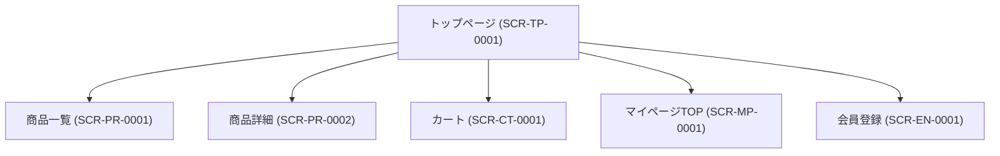

# 画面設計書

---

## ドキュメント情報

| 項目 | 内容 |
|------|------|
| ドキュメントID | SCR-TP-0001 |
| 対象機能 | トップページ |
| 作成日 | 2026-04-11 |
| 作成者 | ※要確認 |
| 最終更新日 | 2026-04-11 |
| 版数 | 1.0 |
| 承認者 | ※要確認 |

---

## 画面遷移図

---

## 画面詳細定義

### トップページ（画面ID：SCR-TP-0001）

#### 画面概要

| 項目 | 内容 |
|------|------|
| 画面名 | トップページ |
| 画面ID | SCR-TP-0001 |
| URL/パス | / |
| ルート名 | homepage |
| コントローラー | TopController#index |
| テンプレート | index.twig |
| アクセス権限 | 全ユーザー（ゲスト含む） ※推測 |
| 前画面 | — |
| 次画面 | 商品一覧 (SCR-PR-0001)、マイページ、会員登録 等 |

#### 表示項目定義

| # | 項目ID | 項目名 | 種別 | 参照テーブル/カラム | 表示条件 | 備考 |
|---|--------|--------|------|-------------------|---------|------|
| 1 | MAIN_VISUAL | メインビジュアル・バナー | 表示 | ※要確認 | 常時 | ※推測（管理画面Block機能による構成） |
| 2 | NEW_PRODUCTS | 新着商品 | 表示 | product | 常時 | ※推測 |
| 3 | CATEGORY_NAV | カテゴリナビゲーション | 表示 | category | 常時 | ※推測 |

> ※実装と乖離の可能性（index.twigはBlock機能でカスタマイズされるため、実際の表示内容は管理画面設定に依存）

#### ボタン定義

| ボタン名 | 処理内容 | 遷移先 | 表示条件 |
|---------|---------|--------|---------|
| ※要確認 | ※要確認 | ※要確認 | ※要確認 |

---

## 変更履歴

| 版数 | 変更日 | 変更者 | 変更内容 |
|------|--------|--------|---------|
| 1.0 | 2026-04-11 | ※要確認 | 初版作成（ec-cube/ec-cube 4.3ブランチよりリバース） |
