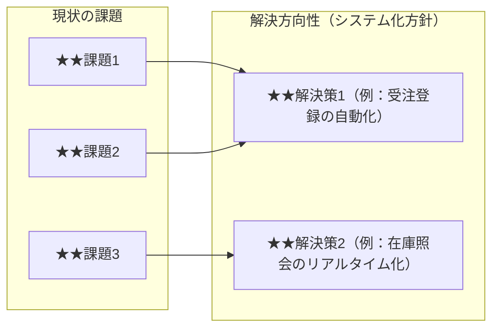

- このドキュメントは課題一覧.mdのテンプレートです。
- ★★または> ★★ で始まる文章とその周辺は、このドキュメントを作成する際の指示文のため、指示として受け止め、最終成果物には残さないでください。

# 課題一覧

---

## ドキュメント情報

> ★★ このドキュメントの管理情報（ID・日付・作成者・承認者）を記入する

| 項目 | 内容 |
|------|------|
| ドキュメントID | ISS-[連番4桁] |
| 作成日 | ★★YYYY-MM-DD |
| 作成者 | ★★氏名 |
| 版数 | 1.0 |

---

## 課題一覧

> ★★ 現状業務の課題を課題IDを付けて一覧化する。課題IDはISS-001から連番で採番する

| 課題ID | カテゴリ | 課題内容 | 発生頻度 | 業務影響 | 解決方向性 | 優先度 |
|--------|---------|---------|---------|---------|----------|--------|
| ISS-001 | ★★カテゴリ（例：工数・品質・ミス） | ★★課題の内容（事実として記述） | ★★日次／週次など | ★★業務への影響（時間・コスト・品質） | ★★この課題をどう解決するか（システム化方針） | 高／中／低 |

> **優先度の定義**
> - 高：放置すると業務継続が困難 / 経営へのインパクトが大きい
> - 中：解決することで業務効率が大幅改善する
> - 低：あると便利だが優先度は低い

---

## 課題・解決策の関係図

> ★★ 課題と解決策（システム化方針）の対応関係をMermaidフローチャートで図示する

---

## 変更履歴

> ★★ ドキュメントの改版履歴を記録する。初版作成時は版数1.0、変更内容に「初版作成」と記入する

| 版数 | 変更日 | 変更者 | 変更内容 |
|------|--------|--------|---------|
| 1.0 | ★★YYYY-MM-DD | ★★氏名 | 初版作成 |
