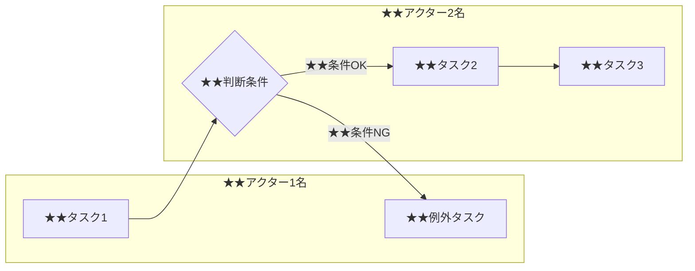
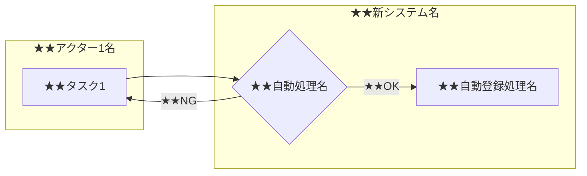

- このドキュメントは業務フロー.mdのテンプレートです。
- ★★または> ★★ で始まる文章とその周辺は、このドキュメントを作成する際の指示文のため、指示として受け止め、最終成果物には残さないでください。

# 業務フロー図

---

## ドキュメント情報

> ★★ このドキュメントの管理情報（ID・日付・作成者・承認者）を記入する

| 項目 | 内容 |
|------|------|
| ドキュメントID | BPF-[連番4桁] |
| 対象業務 | ★★対象となる業務名（例：受注処理業務） |
| 作成日 | ★★YYYY-MM-DD |
| 作成者 | ★★氏名 |
| 最終更新日 | ★★YYYY-MM-DD |
| 版数 | 1.0 |
| 承認者 | ★★顧客担当者氏名 |

---

## AS-IS（現状業務フロー）

> ★★ 現状業務の目的・背景・関係部門の概要を記述し、現状フローをMermaidで図示する

### 概要

> ★★ このフェーズの業務目的・背景・関係部門を2〜3文で記述する
★★現状の業務目的・背景・関係部門を記述する。

### 課題・問題点

> ★★ 現状業務で発生している問題点・業務への影響・発生頻度を記述する

| # | 問題点 | 影響 | 頻度 |
|---|--------|------|------|
| 1 | ★★問題点の内容 | ★★業務への影響 | ★★日次／週次など |

### フロー図

> ★★ 業務の流れをMermaidフローチャートで図示する。アクターをsubgraphで区切り、処理・判断・例外を示す

---

## TO-BE（将来業務フロー）

> ★★ システム導入後の業務フローをMermaidで図示し、AS-ISからの変更点と期待効果を記述する

### 概要

> ★★ このフェーズの業務目的・背景・関係部門を2〜3文で記述する
★★システム導入によって何がどう変わるかを記述する。

### フロー図

> ★★ 業務の流れをMermaidフローチャートで図示する。アクターをsubgraphで区切り、処理・判断・例外を示す

### 変更点サマリー

> ★★ AS-ISからTO-BEへの変更点と期待効果を変更点ごとに対比形式で記述する

| 変更点 | AS-IS | TO-BE | 期待効果 |
|--------|-------|-------|---------|
| ★★変更点名 | ★★現状の内容 | ★★改善後の内容 | ★★定量・定性効果 |

---

## 変更履歴

> ★★ ドキュメントの改版履歴を記録する。初版作成時は版数1.0、変更内容に「初版作成」と記入する

| 版数 | 変更日 | 変更者 | 変更内容 |
|------|--------|--------|---------|
| 1.0 | ★★YYYY-MM-DD | ★★氏名 | 初版作成 |
