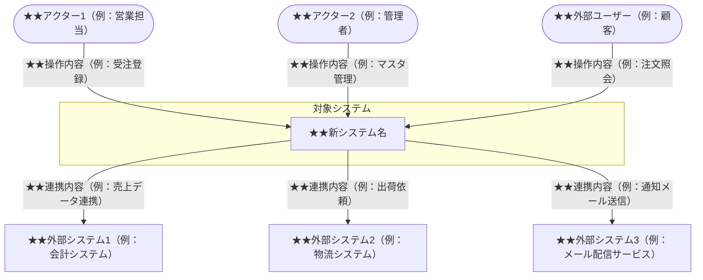

- このドキュメントはシステム関連図.mdのテンプレートです。
- ★★または> ★★ で始まる文章とその周辺は、このドキュメントを作成する際の指示文のため、指示として受け止め、最終成果物には残さないでください。

# システム関連図

---

## ドキュメント情報

> ★★ このドキュメントの管理情報（ID・日付・作成者・承認者）を記入する

| 項目 | 内容 |
|------|------|
| ドキュメントID | SCD-[連番4桁] |
| 対象システム | ★★システム名 |
| 作成日 | ★★YYYY-MM-DD |
| 作成者 | ★★氏名 |
| 最終更新日 | ★★YYYY-MM-DD |
| 版数 | 1.0 |
| 承認者 | ★★承認者氏名 |

---

## システムコンテキスト図

> ★★ 中央の対象システムと、連携する外部システム・アクターの関係を示す。詳細なサーバー構成（システム構成図）とは異なり、業務上の連携関係に着目する。

---

## 外部システム連携一覧

> ★★ 対象システムと連携するすべての外部システムを連携方向・方式・内容・タイミング・担当組織とともに一覧化する

| # | 連携先システム名 | 連携方向 | 連携方式 | 連携内容 | 連携タイミング | 担当組織 |
|---|---------------|---------|---------|---------|-------------|---------|
| 1 | ★★連携先システム名 | 送信／受信／双方向 | ★★API／ファイル連携／DB直結 | ★★やりとりするデータの内容 | ★★リアルタイム／日次バッチ等 | ★★担当部署または会社名 |

---

## アクター一覧

> ★★ システムを利用するすべてのアクター（ユーザー種別）を役割・想定人数・利用端末とともに一覧化する

| # | アクター名 | 種別 | 役割・利用目的 | 想定人数 | 利用端末 |
|---|----------|------|-------------|---------|---------|
| 1 | ★★アクター名 | 社内ユーザー／外部ユーザー／管理者 | ★★このアクターがシステムを使う目的 | ★★人数規模 | ★★PC／スマートフォン／タブレット |

---

## システム境界の定義

> ★★ 本システムが担う機能・業務（スコープ内）と担わない範囲（スコープ外）を明確に記述する

| 項目 | 内容 |
|------|------|
| システム境界（スコープ内） | ★★本システムが担う機能・業務範囲 |
| システム境界（スコープ外） | ★★本システムが担わない機能・業務範囲 |
| 移行対象 | ★★既存システムから移行するデータ・機能 |
| 移行対象外 | ★★移行しない既存機能・データ |

---

## 変更履歴

> ★★ ドキュメントの改版履歴を記録する。初版作成時は版数1.0、変更内容に「初版作成」と記入する

| 版数 | 変更日 | 変更者 | 変更内容 |
|------|--------|--------|---------|
| 1.0 | ★★YYYY-MM-DD | ★★氏名 | 初版作成 |
