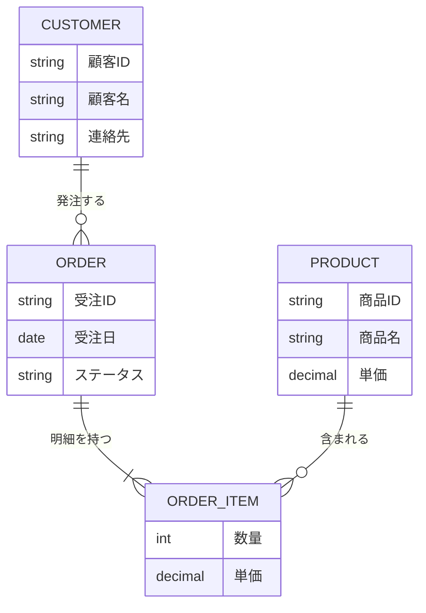

- このドキュメントは概念データモデル.mdのテンプレートです。
- ★★または> ★★ で始まる文章とその周辺は、このドキュメントを作成する際の指示文のため、指示として受け止め、最終成果物には残さないでください。

# 概念データモデル

---

## ドキュメント情報

> ★★ このドキュメントの管理情報（ID・日付・作成者・承認者）を記入する

| 項目 | 内容 |
|------|------|
| ドキュメントID | CDM-[連番4桁] |
| 対象業務 | ★★対象業務名（例：受注管理業務） |
| 作成日 | ★★YYYY-MM-DD |
| 作成者 | ★★氏名 |
| 最終更新日 | ★★YYYY-MM-DD |
| 版数 | 1.0 |
| 承認者 | ★★承認者氏名 |

---

## 概念データモデル図

> ★★ 業務上の主要概念（エンティティ）と関係を示す。物理的なテーブル設計（テーブル定義書）ではなく、業務概念の整理が目的。属性は代表的なものだけを記載する。

> ★★ 上記の図全体を実際の業務エンティティに置き換える

---

## エンティティ一覧

> ★★ ビジネス上の主要エンティティを論理名・物理名候補・概要・種別（リソース/イベント/関連）とともに一覧化する

| # | エンティティ名（論理） | エンティティ名（物理候補） | 概要 | 種別 |
|---|-------------------|----------------------|------|------|
| 1 | ★★エンティティ論理名（例：顧客） | ★★物理名候補（例：customers） | ★★このエンティティが表す業務上の概念 | リソース／イベント／関連 |

**種別の定義**
- **リソース**：マスタデータに相当する概念（顧客、商品、組織など）
- **イベント**：業務上の出来事・取引を表す概念（受注、請求、出荷など）
- **関連**：2つ以上のエンティティを結びつける概念（受注明細、配属など）

---

## リレーションシップ定義

> ★★ エンティティ間の関係を多重度・関係の説明・制約とともに記述する

| # | エンティティA | 多重度 | エンティティB | 関係の説明 | 制約・備考 |
|---|-------------|-------|-------------|----------|---------|
| 1 | ★★エンティティ名 | ★★1対多／多対多 | ★★エンティティ名 | ★★業務上の関係を一文で記述 | ★★排他制約・必須制約など |

---

## 業務ルール・制約

> ★★ エンティティに適用される業務上のルール・制約（例：ステータス遷移ルール）を記述する

| # | ルール名 | 対象エンティティ | 内容 |
|---|---------|--------------|------|
| 1 | ★★ルール名（例：受注ステータス遷移） | ★★対象エンティティ名 | ★★業務として守られなければならない制約・ルール |

---

## 変更履歴

> ★★ ドキュメントの改版履歴を記録する。初版作成時は版数1.0、変更内容に「初版作成」と記入する

| 版数 | 変更日 | 変更者 | 変更内容 |
|------|--------|--------|---------|
| 1.0 | ★★YYYY-MM-DD | ★★氏名 | 初版作成 |
