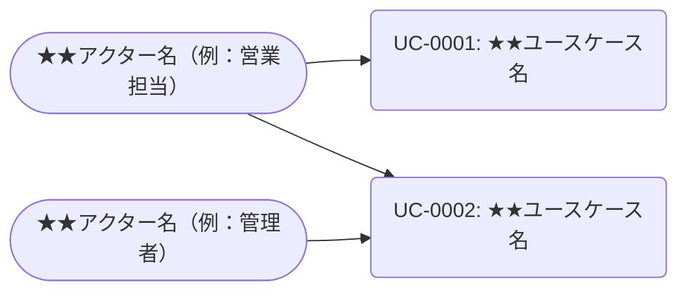

- このドキュメントはユースケース一覧.mdのテンプレートです。
- ★★または> ★★ で始まる文章とその周辺は、このドキュメントを作成する際の指示文のため、指示として受け止め、最終成果物には残さないでください。

# ユースケース一覧

---

## ドキュメント情報

> ★★ このドキュメントの管理情報（ID・日付・作成者・承認者）を記入する

| 項目 | 内容 |
|------|------|
| ドキュメントID | UC-LIST-001 |
| プロジェクト名 | ★★プロジェクト名 |
| 作成日 | ★★YYYY-MM-DD |
| 作成者 | ★★氏名 |
| 版数 | 1.0 |
| 承認者 | ★★承認者氏名 |

---

## ユースケース一覧

> ★★ 業務フロー図・システム関連図をもとに全ユースケースを洗い出し一覧化する。UC IDは `UC-[連番4桁]` の形式で採番する

| UC ID | ユースケース名 | 主アクター | 優先度 | 対応要件ID | 記述ファイル |
|-------|--------------|----------|--------|-----------|------------|
| UC-0001 | ★★ユースケース名（例：受注登録） | ★★アクター名（例：営業担当） | 高／中／低 | ★★REQ-XX-XXXX | `docs/01_要件定義/04_ユースケース/UC-0001_★★.md` |
| UC-0002 | ★★ユースケース名 | ★★アクター名 | 高／中／低 | ★★REQ-XX-XXXX | `docs/01_要件定義/04_ユースケース/UC-0002_★★.md` |

> **優先度の基準**
> - 高：リリース必須。欠けるとビジネスが成立しない
> - 中：リリース対象だが代替手段がある
> - 低：将来リリース候補

---

## ユースケース図（全体）

> ★★ アクターごとに担当するユースケースの全体像をMermaid graph LRで図示する

---

## 変更履歴

> ★★ ドキュメントの改版履歴を記録する。初版作成時は版数1.0、変更内容に「初版作成」と記入する

| 版数 | 変更日 | 変更者 | 変更内容 |
|------|--------|--------|---------|
| 1.0 | ★★YYYY-MM-DD | ★★氏名 | 初版作成 |
