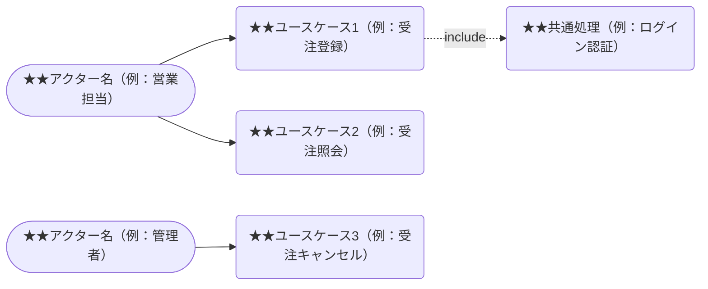

- このドキュメントはユースケース記述.mdのテンプレートです。
- ★★または> ★★ で始まる文章とその周辺は、このドキュメントを作成する際の指示文のため、指示として受け止め、最終成果物には残さないでください。

# ユースケース記述

---

## ドキュメント情報

> ★★ このドキュメントの管理情報（ID・日付・作成者・承認者）を記入する

| 項目 | 内容 |
|------|------|
| ドキュメントID | UC-[連番4桁] |
| ユースケース名 | ★★ユースケース名（例：受注登録） |
| 対応要件ID | ★★REQ-XX-XXXX |
| 作成日 | ★★YYYY-MM-DD |
| 作成者 | ★★氏名 |
| 版数 | 1.0 |

---

## ユースケース図

> ★★ アクターとユースケースの関係をMermaid graph LRで図示する。includeはdotted arrowで示す

---

## ユースケース詳細

> ★★ ユースケースの基本情報・正常フロー・代替フロー・例外フローを記述する

### 基本情報

> ★★ ユースケースのID・名称・アクター・事前条件・事後条件を記入する

| 項目 | 内容 |
|------|------|
| ユースケースID | UC-[連番4桁] |
| ユースケース名 | ★★ユースケース名 |
| アクター | ★★主アクター名（例：営業担当） |
| 事前条件 | ★★このユースケースが開始される前に満たされていなければならない条件 |
| 事後条件（成功時） | ★★正常終了した場合にシステムが達成した状態 |
| 事後条件（失敗時） | ★★失敗した場合のシステム状態 |

---

### 正常フロー（基本フロー）

> ★★ ユースケースが成功した場合のアクター操作とシステム応答をステップごとに記述する

| ステップ | アクター操作 | システム応答 |
|---------|------------|------------|
| 1 | ★★アクターの操作（例：受注登録画面を開く） | ★★システムの応答（例：受注入力フォームを表示する） |
| 2 | ★★アクターの操作 | ★★システムの応答 |
| 3 | ★★アクターの操作 | ★★システムの応答 |

---

### 代替フロー

> ★★ 正常フローとは異なるが成功に至る代替の処理フローを記述する（例：下書き保存）

#### 代替フロー1：★★フロー名（例：下書き保存）

| 発生条件 | ★★どのステップでどのような状況が発生した場合か |
|---------|------|

| ステップ | 内容 |
|---------|------|
| A1 | ★★代替フローの処理内容 |
| A2 | ★★正常フローに戻る場合はどのステップに戻るかを記載 |

---

### 例外フロー

> ★★ エラー・異常が発生した場合の処理フローとユーザーへの誘導を記述する

#### 例外フロー1：★★例外名（例：入力値検証エラー）

| 発生条件 | ★★どのステップでどのような異常が発生した場合か |
|---------|------|

| ステップ | 内容 |
|---------|------|
| E1 | ★★エラーメッセージの表示内容 |
| E2 | ★★ユーザーへの誘導（例：入力フォームに戻り再入力を促す） |

---

## 変更履歴

> ★★ ドキュメントの改版履歴を記録する。初版作成時は版数1.0、変更内容に「初版作成」と記入する

| 版数 | 変更日 | 変更者 | 変更内容 |
|------|--------|--------|---------|
| 1.0 | ★★YYYY-MM-DD | ★★氏名 | 初版作成 |
