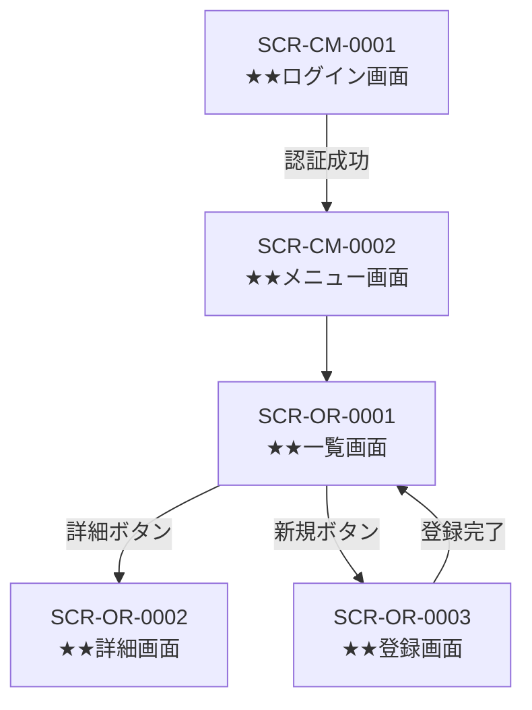

- このドキュメントは機能一覧.mdのテンプレートです。
- ★★または> ★★ で始まる文章とその周辺は、このドキュメントを作成する際の指示文のため、指示として受け止め、最終成果物には残さないでください。

# 機能一覧

> このドキュメントはシステムで作成する成果物（画面・API・バッチ・帳票）のスコープを定義します。各成果物の詳細仕様は設計フェーズで定義します。

---

## ドキュメント情報

> ★★ このドキュメントの管理情報（ID・日付・作成者・承認者）を記入する

| 項目 | 内容 |
|------|------|
| ドキュメントID | FUNC-SCOPE-001 |
| 対象システム | ★★システム名 |
| 作成日 | ★★YYYY-MM-DD |
| 作成者 | ★★氏名 |
| 最終更新日 | ★★YYYY-MM-DD |
| 版数 | 1.0 |
| 承認者 | ★★承認者氏名 |

---

## 画面一覧

> ★★ システムに存在する全画面を洗い出す。画面IDは `SCR-[機能カテゴリ2文字]-[連番4桁]` で採番する（例：SCR-CM-0001）

| # | 画面ID | 画面名 | 機能カテゴリ | 種別 | 対象ユーザー | 対応要件ID |
|---|-------|-------|-----------|------|-----------|----------|
| 1 | SCR-CM-0001 | ★★画面名（例：ログイン画面） | ★★共通 | 入力 | ★★全ユーザー | ★★REQ-F-XXXX |
| 2 | SCR-OR-0001 | ★★画面名（例：受注一覧画面） | ★★受注管理 | 一覧 | ★★担当者 | ★★REQ-F-XXXX |
| 3 | SCR-OR-0002 | ★★画面名（例：受注登録画面） | ★★受注管理 | 登録 | ★★担当者 | ★★REQ-F-XXXX |

**画面種別の定義**
- **一覧**：データの検索・一覧表示
- **詳細**：1件のデータの参照
- **登録**：新規データの入力・登録
- **編集**：既存データの変更
- **確認**：登録・変更前の確認画面・ダイアログ
- **入力**：ログイン・検索条件等の入力専用画面
- **その他**：メニュー・ダッシュボード・エラー画面等

---

## 画面遷移図

> ★★ 画面間の遷移関係をMermaid flowchartで図示する。画面IDを使用し、遷移条件をエッジラベルで示す

---

## API一覧

> ★★ システムが提供する全APIエンドポイントを洗い出す。詳細なリクエスト・レスポンス仕様は設計フェーズのAPI設計書で定義する

| # | APIメソッド | パス | 概要 | 対応画面ID | 対応要件ID |
|---|-----------|------|------|----------|----------|
| 1 | GET | ★★/api/orders | ★★受注一覧取得 | SCR-OR-0001 | ★★REQ-F-XXXX |
| 2 | POST | ★★/api/orders | ★★受注登録 | SCR-OR-0003 | ★★REQ-F-XXXX |
| 3 | GET | ★★/api/orders/{id} | ★★受注詳細取得 | SCR-OR-0002 | ★★REQ-F-XXXX |
| 4 | PUT | ★★/api/orders/{id} | ★★受注更新 | SCR-OR-0002 | ★★REQ-F-XXXX |

---

## バッチ一覧

> ★★ システムで実行する全バッチ処理を洗い出す。詳細な処理仕様は設計フェーズのバッチ設計書で定義する

| # | バッチID | バッチ名 | 概要 | 起動タイミング | 対応要件ID |
|---|---------|---------|------|-------------|----------|
| 1 | BATCH-0001 | ★★バッチ名（例：日次売上集計バッチ） | ★★処理の概要 | ★★毎日23:00 | ★★REQ-F-XXXX |

---

## 帳票一覧

> ★★ システムが出力する全帳票を洗い出す。詳細なレイアウト・データソース仕様は設計フェーズの帳票設計書で定義する

| # | 帳票ID | 帳票名 | 機能カテゴリ | 出力形式 | 出力タイミング | 対応要件ID |
|---|-------|-------|-----------|---------|-------------|----------|
| 1 | RPT-0001 | ★★帳票名（例：受注確認書） | ★★受注管理 | PDF / Excel / CSV | ★★画面出力 / バッチ出力 | ★★REQ-F-XXXX |

---

## 変更履歴

> ★★ ドキュメントの改版履歴を記録する。初版作成時は版数1.0、変更内容に「初版作成」と記入する

| 版数 | 変更日 | 変更者 | 変更内容 |
|------|--------|--------|---------|
| 1.0 | ★★YYYY-MM-DD | ★★氏名 | 初版作成 |
