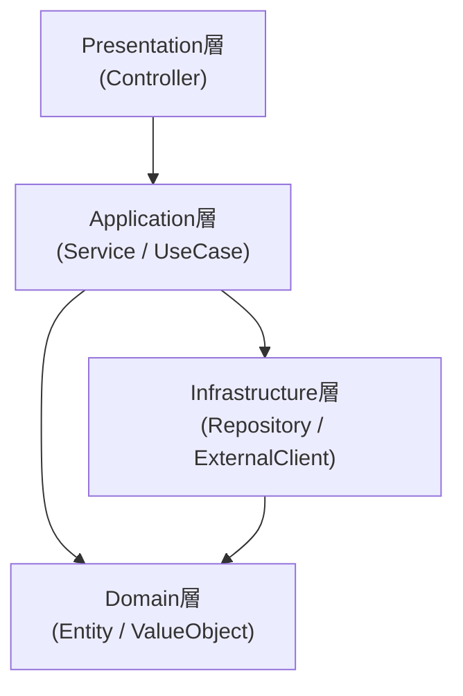

- このドキュメントはアーキテクチャ設計書.mdのテンプレートです。
- ★★または> ★★ で始まる文章とその周辺は、このドキュメントを作成する際の指示文のため、指示として受け止め、最終成果物には残さないでください。

# アーキテクチャ設計書

---

## ドキュメント情報

> ★★ このドキュメントの管理情報（ID・日付・作成者・承認者）を記入する

| 項目 | 内容 |
|------|------|
| ドキュメントID | ARCH-001 |
| プロジェクト名 | ★★プロジェクト名 |
| 作成日 | ★★YYYY-MM-DD |
| 作成者 | ★★氏名 |
| 版数 | 1.0 |
| 承認者 | ★★承認者氏名 |

---

## アーキテクチャスタイル

> ★★ 採用するアーキテクチャスタイルとその選定理由を記述する。例：レイヤードアーキテクチャ / ヘキサゴナル / クリーンアーキテクチャ / DDD戦術設計 / MVC 等

| 項目 | 内容 |
|------|------|
| スタイル | ★★例：レイヤードアーキテクチャ（3層） |
| 選定理由 | ★★要件・チームスキル・拡張性の観点から選定理由 |

---

## レイヤー構成と依存方向

> ★★ レイヤー（またはモジュール）の一覧と、許可される依存方向を図示する。依存の方向は矢印で明示する



---

## レイヤー責務

> ★★ 各レイヤーに「書いてよいもの」「書いてはいけないもの」を定義する

| レイヤー | 責務 | 書いてよいもの | 書いてはいけないもの |
|---------|------|-------------|-------------------|
| Presentation | リクエスト受付・レスポンス整形 | 入力バリデーション、DTO変換、Service呼び出し | ビジネスロジック、SQL、外部通信 |
| Application | ユースケース実行・トランザクション境界 | ユースケース手順、TX境界、Service/Repository呼び出し | HTTPの知識、SQL、UI整形 |
| Domain | 業務ルール・業務概念 | Entity・ValueObject・ドメインサービス・不変条件 | フレームワーク依存、DB/HTTPの知識 |
| Infrastructure | 外部システムとの接続 | SQL、HTTPクライアント、ファイルI/O | ビジネスルール |

---

## モジュール／パッケージ構成

> ★★ ソースコードのディレクトリ／パッケージ分割方針を記述する。機能単位（feature-based）か、レイヤー単位（layer-based）かを明記する

```
src/main/
├── presentation/       ★★例：Controller
├── application/        ★★Service / UseCase
├── domain/             ★★Entity / ValueObject
└── infrastructure/     ★★Repository実装 / 外部API呼び出し
```

---

## 横断的関心事の配置方針

> ★★ 認証・ログ・例外処理・トランザクションなどの横断的関心事をどこで扱うかの方針を記述する。詳細は各方式設計書を参照

| 関心事 | 配置層 | 参照先 |
|--------|-------|-------|
| 認証認可 | ★★例：Presentation層のフィルタ | `docs/02_設計/00_方式設計/03_認証認可方式.md` |
| 例外処理 | ★★例：Presentation層の例外ハンドラ | `docs/02_設計/00_方式設計/04_例外処理方式.md` |
| ログ | ★★例：全層共通のロガー | `docs/02_設計/00_方式設計/05_ログ方式.md` |
| トランザクション | ★★例：Application層で境界管理 | `docs/02_設計/00_方式設計/06_トランザクション方式.md` |
| セッション | ★★例：Presentation層で管理 | `docs/02_設計/00_方式設計/07_セッション方式.md` |

---

## 変更履歴

> ★★ ドキュメントの改版履歴を記録する。初版作成時は版数1.0、変更内容に「初版作成」と記入する

| 版数 | 変更日 | 変更者 | 変更内容 |
|------|--------|--------|---------|
| 1.0 | ★★YYYY-MM-DD | ★★氏名 | 初版作成 |
