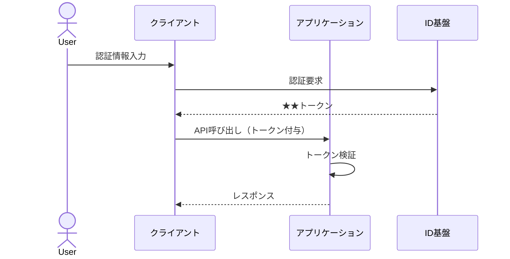

- このドキュメントは認証認可方式.mdのテンプレートです。
- ★★または> ★★ で始まる文章とその周辺は、このドキュメントを作成する際の指示文のため、指示として受け止め、最終成果物には残さないでください。

# 認証認可方式

---

## ドキュメント情報

> ★★ このドキュメントの管理情報（ID・日付・作成者・承認者）を記入する

| 項目 | 内容 |
|------|------|
| ドキュメントID | AUTH-001 |
| プロジェクト名 | ★★プロジェクト名 |
| 作成日 | ★★YYYY-MM-DD |
| 作成者 | ★★氏名 |
| 版数 | 1.0 |
| 承認者 | ★★承認者氏名 |

---

## 認証方式

> ★★ 採用する認証方式を記述する。例：フォーム認証 / OAuth2.0 / OpenID Connect / JWT / LDAP / SAML

| 項目 | 内容 |
|------|------|
| 認証方式 | ★★例：OpenID Connect（Authorization Code Flow） |
| ID基盤 | ★★例：Auth0 / Keycloak / 自前 |
| 資格情報 | ★★例：メールアドレス＋パスワード |
| パスワードポリシー | ★★例：最低8文字・英数記号混在 |
| アカウントロック | ★★例：5回連続失敗で30分ロック |

---

## 認証フロー

> ★★ ログイン〜トークン発行〜API呼び出し〜ログアウトまでのシーケンスを図示する

---

## 認可方式

> ★★ 採用する認可方式を記述する。例：RBAC / ABAC / ACL

| 項目 | 内容 |
|------|------|
| 認可方式 | ★★例：RBAC（ロールベース） |
| ロール一覧 | ★★例：管理者 / 一般ユーザー / ゲスト |
| 権限チェック場所 | ★★例：Presentation層のフィルタで一次チェック、Service層で業務上の権限チェック |

---

## セッション・トークン管理

> ★★ セッションやトークンの有効期限、保存場所、失効方法を記述する。セッション方式の詳細は `07_セッション方式.md` を参照

| 項目 | 内容 |
|------|------|
| アクセストークン有効期限 | ★★例：60分 |
| リフレッシュトークン有効期限 | ★★例：7日 |
| 保存場所 | ★★例：HttpOnly Cookie / Authorization Header |
| 失効方法 | ★★例：ログアウト時にIDP側で無効化 |

---

## 変更履歴

> ★★ ドキュメントの改版履歴を記録する。初版作成時は版数1.0、変更内容に「初版作成」と記入する

| 版数 | 変更日 | 変更者 | 変更内容 |
|------|--------|--------|---------|
| 1.0 | ★★YYYY-MM-DD | ★★氏名 | 初版作成 |
