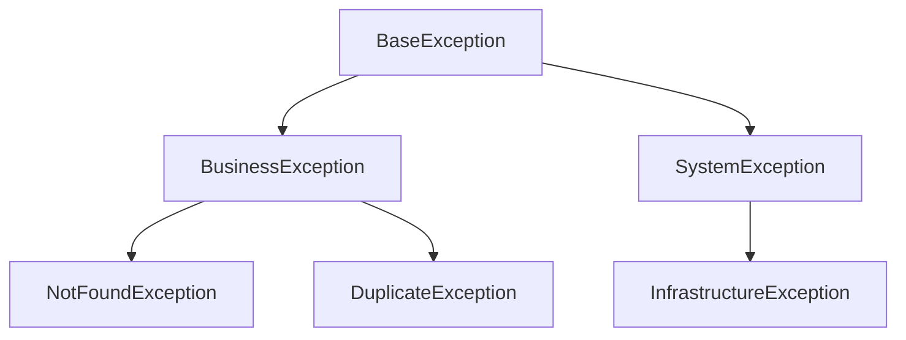

- このドキュメントは例外処理方式.mdのテンプレートです。
- ★★または> ★★ で始まる文章とその周辺は、このドキュメントを作成する際の指示文のため、指示として受け止め、最終成果物には残さないでください。

# 例外処理方式

---

## ドキュメント情報

> ★★ このドキュメントの管理情報（ID・日付・作成者・承認者）を記入する

| 項目 | 内容 |
|------|------|
| ドキュメントID | EXC-001 |
| プロジェクト名 | ★★プロジェクト名 |
| 作成日 | ★★YYYY-MM-DD |
| 作成者 | ★★氏名 |
| 版数 | 1.0 |
| 承認者 | ★★承認者氏名 |

---

## 例外分類

> ★★ 業務例外とシステム例外の区別、および扱い方針を記述する

| 分類 | 定義 | 発生例 | 扱い方針 |
|------|------|-------|---------|
| 業務例外 | ★★業務ルール違反によって正常に処理できない状況 | ★★残高不足・重複登録 | ★★利用者に原因を伝え、再操作を促す |
| システム例外 | ★★技術的障害によって処理継続不可 | ★★DB接続失敗・NullPointerException | ★★利用者には抽象的メッセージ、詳細はログに記録 |

---

## 例外クラス階層

> ★★ 例外クラスの継承関係を図示する



---

## エラーレスポンス形式

> ★★ APIが返すエラーレスポンスのJSON構造を定義する

```json
{
  "errorCode": "★★例：E-BIZ-0001",
  "message": "★★利用者向けメッセージ",
  "timestamp": "2026-04-11T12:00:00Z",
  "traceId": "★★リクエスト追跡ID"
}
```

| フィールド | 必須 | 説明 |
|----------|:----:|------|
| errorCode | ○ | ★★エラーコード体系 |
| message | ○ | ★★利用者向けのメッセージ |
| timestamp | ○ | ★★発生時刻（ISO8601） |
| traceId | ○ | ★★ログと突合するための追跡ID |

---

## HTTPステータスコード対応

> ★★ 業務例外・システム例外とHTTPステータスコードの対応を記述する

| 例外種別 | HTTPステータス | 用途 |
|---------|:------------:|------|
| 入力エラー | 400 | バリデーション違反 |
| 認証エラー | 401 | 未認証 |
| 認可エラー | 403 | 権限不足 |
| 業務例外（NotFound） | 404 | リソース未発見 |
| 業務例外（Duplicate） | 409 | 競合・重複 |
| システム例外 | 500 | 想定外エラー |

---

## 例外ハンドリング配置

> ★★ 例外をどこで捕捉してレスポンスに変換するかを記述する

| 層 | 扱い |
|----|------|
| Domain / Application | ★★例外を投げる（ログは出さない） |
| Presentation | ★★共通例外ハンドラで捕捉し、エラーレスポンスに変換。ログもここで出力 |

---

## 変更履歴

> ★★ ドキュメントの改版履歴を記録する。初版作成時は版数1.0、変更内容に「初版作成」と記入する

| 版数 | 変更日 | 変更者 | 変更内容 |
|------|--------|--------|---------|
| 1.0 | ★★YYYY-MM-DD | ★★氏名 | 初版作成 |
