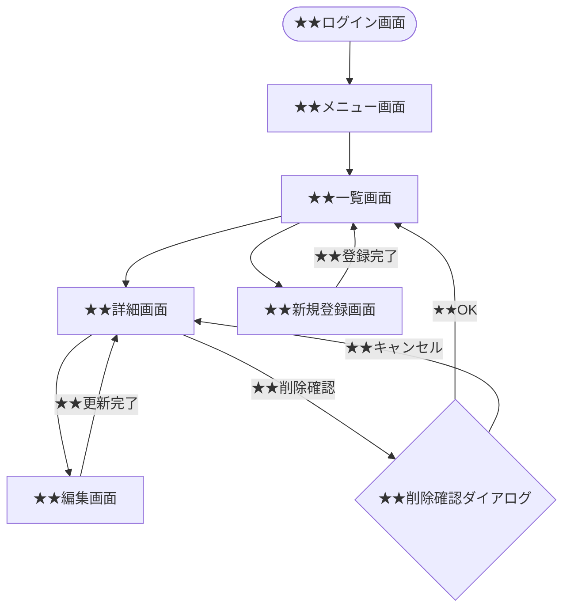

- このドキュメントは画面設計書.mdのテンプレートです。
- ★★または> ★★ で始まる文章とその周辺は、このドキュメントを作成する際の指示文のため、指示として受け止め、最終成果物には残さないでください。

# 画面設計書

---

## ドキュメント情報

> ★★ このドキュメントの管理情報（ID・日付・作成者・承認者）を記入する

| 項目 | 内容 |
|------|------|
| ドキュメントID | SCR-[機能カテゴリ2文字]-[連番4桁] |
| 対象機能 | ★★対象機能名（例：受注管理機能） |
| 作成日 | ★★YYYY-MM-DD |
| 作成者 | ★★氏名 |
| 最終更新日 | ★★YYYY-MM-DD |
| 版数 | 1.0 |
| 承認者 | ★★顧客担当者氏名 |

---

## 画面遷移図

> ★★ この遷移図全体を実際の画面構成に置き換える

---

## 画面詳細定義

> ★★ 画面ごとに画面概要・表示項目・バリデーション・ボタン・エラーメッセージを定義する

### ★★画面名（画面ID：SCR-XX-XXXX）

#### 画面概要

| 項目 | 内容 |
|------|------|
| 画面名 | ★★画面名 |
| 画面ID | ★★SCR-XX-XXXX |
| URL/パス | ★★/path/to/screen |
| アクセス権限 | ★★アクセス可能なロール名 |
| 前画面 | ★★遷移元画面名 |
| 次画面 | ★★遷移先画面名 |

#### 表示項目定義

| # | 項目ID | 項目名 | 種別 | 参照テーブル/カラム | 表示条件 | 備考 |
|---|--------|--------|------|-------------------|---------|------|
| 1 | ★★FIELD_001 | ★★項目名 | 表示／入力／選択 | ★★table.column | ★★常時 or 条件 | |

> **種別の定義**
> - 表示：読み取り専用
> - 入力：テキスト入力
> - 選択：プルダウン・ラジオ・チェックボックス

#### 入力バリデーション

| 項目ID | 項目名 | 必須 | 文字種 | 桁数 | その他制約 |
|--------|--------|------|--------|------|-----------|
| ★★FIELD_001 | ★★項目名 | 必須／任意 | ★★半角英数字など | ★★最大○文字 | ★★範囲・形式など |

#### ボタン定義

| ボタン名 | 処理内容 | 遷移先 | 表示条件 |
|---------|---------|--------|---------|
| ★★ボタン名（例：登録） | ★★処理の内容 | ★★遷移先画面ID | ★★常時 or 条件 |

#### エラーメッセージ定義

| エラーコード | 発生条件 | 表示メッセージ |
|------------|---------|-------------|
| ★★ERR-XXXX | ★★エラーが発生する条件 | ★★ユーザーに表示するメッセージ文言 |

---

## 変更履歴

> ★★ ドキュメントの改版履歴を記録する。初版作成時は版数1.0、変更内容に「初版作成」と記入する

| 版数 | 変更日 | 変更者 | 変更内容 |
|------|--------|--------|---------|
| 1.0 | ★★YYYY-MM-DD | ★★氏名 | 初版作成 |
