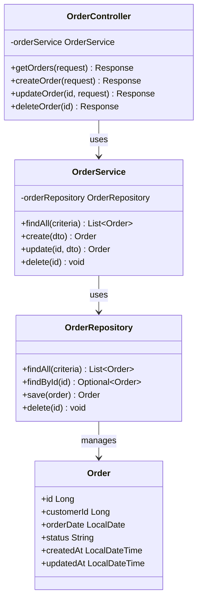
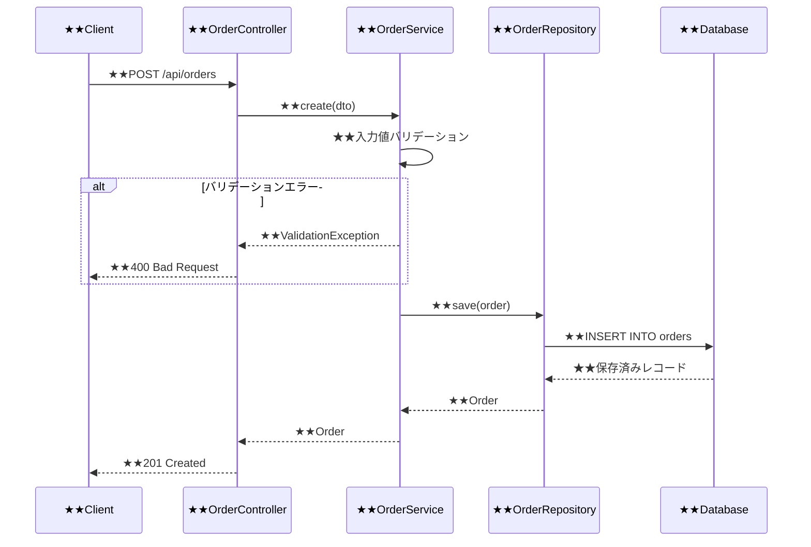

- このドキュメントはクラス設計書.mdのテンプレートです。
- ★★または> ★★ で始まる文章とその周辺は、このドキュメントを作成する際の指示文のため、指示として受け止め、最終成果物には残さないでください。

# クラス設計書

---

## ドキュメント情報

> ★★ このドキュメントの管理情報（ID・日付・作成者・承認者）を記入する

| 項目 | 内容 |
|------|------|
| ドキュメントID | CLS-[連番4桁] |
| 対象機能 | ★★対象機能名（例：受注管理機能） |
| 作成日 | ★★YYYY-MM-DD |
| 作成者 | ★★氏名 |
| 最終更新日 | ★★YYYY-MM-DD |
| 版数 | 1.0 |

---

## クラス図

> ★★ このクラス図全体を実際のクラス構成に置き換える

---

## クラス詳細定義

> ★★ クラスごとにパッケージ・責務・依存クラス・メソッド定義を記述する

### ★★クラス名（例：OrderService）

| 項目 | 内容 |
|------|------|
| クラス名 | ★★クラス名 |
| パッケージ/名前空間 | ★★com.example.service など |
| 責務 | ★★このクラスが担う単一の責任を一文で記述 |
| 依存クラス | ★★依存するクラス名（コンストラクタインジェクション） |

#### メソッド定義

| # | メソッド名 | 引数 | 戻り値 | 処理概要 | 例外 |
|---|-----------|------|--------|---------|------|
| 1 | ★★メソッド名 | ★★引数名:型 | ★★戻り値型 | ★★処理内容を箇条書きで記述 | ★★スローする例外クラス名と条件 |

---

## シーケンス図

> ★★ ユースケースの処理フローをMermaid sequenceDiagramで図示する

### ★★ユースケース名（例：受注登録処理）

---

## 変更履歴

> ★★ ドキュメントの改版履歴を記録する。初版作成時は版数1.0、変更内容に「初版作成」と記入する

| 版数 | 変更日 | 変更者 | 変更内容 |
|------|--------|--------|---------|
| 1.0 | ★★YYYY-MM-DD | ★★氏名 | 初版作成 |
