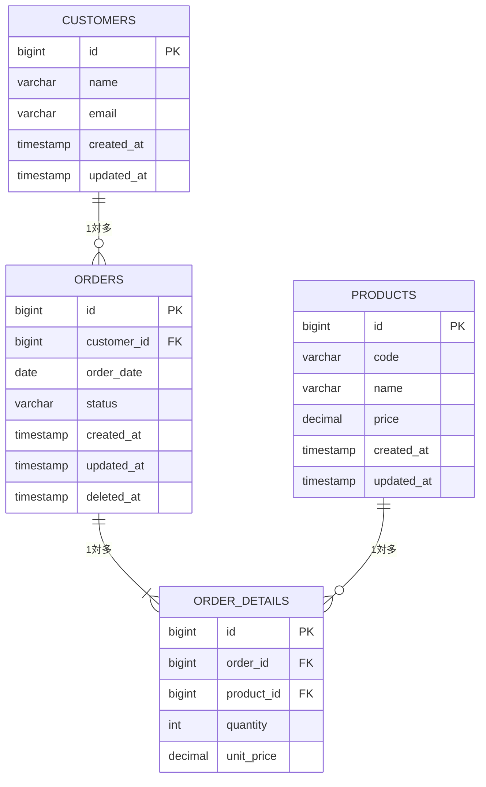

- このドキュメントはER図.mdのテンプレートです。
- ★★または> ★★ で始まる文章とその周辺は、このドキュメントを作成する際の指示文のため、指示として受け止め、最終成果物には残さないでください。

# ER図

> このドキュメントはシステム全体のテーブル関係図です。テーブル一覧および各テーブル定義書と合わせて参照してください。

---

## ドキュメント情報

> ★★ このドキュメントの管理情報（ID・日付・作成者・承認者）を記入する

| 項目 | 内容 |
|------|------|
| ドキュメントID | ER-001 |
| プロジェクト名 | ★★プロジェクト名 |
| 対象スキーマ | ★★スキーマ名（例：public） |
| 作成日 | ★★YYYY-MM-DD |
| 作成者 | ★★氏名 |
| 版数 | 1.0 |
| 承認者 | ★★承認者氏名 |

---

## ER図（全体）

> ★★ システム全体のテーブル関係をMermaid erDiagramで図示する。全テーブルを網羅すること

---

## 変更履歴

> ★★ ドキュメントの改版履歴を記録する。初版作成時は版数1.0、変更内容に「初版作成」と記入する

| 版数 | 変更日 | 変更者 | 変更内容 |
|------|--------|--------|---------|
| 1.0 | ★★YYYY-MM-DD | ★★氏名 | 初版作成 |
