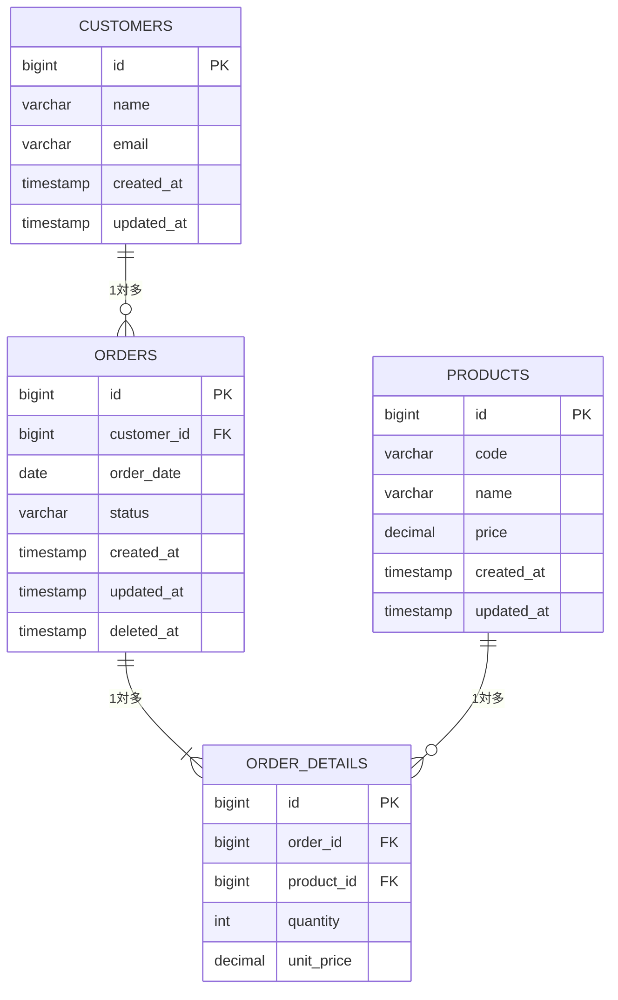

- このドキュメントはテーブル定義書.mdのテンプレートです。ドメイン単位でコピーして使用してください。
- ファイル名は `DB-DEF-[連番4桁]_{ドメイン名}.md` の形式で保存してください（例：DB-DEF-0001_受注管理.md）
- ★★または> ★★ で始まる文章とその周辺は、このドキュメントを作成する際の指示文のため、指示として受け止め、最終成果物には残さないでください。

# テーブル定義書

---

## ドキュメント情報

> ★★ このドキュメントの管理情報（ID・日付・作成者・承認者）を記入する

| 項目 | 内容 |
|------|------|
| ドキュメントID | DB-DEF-[連番4桁] |
| 対象スキーマ | ★★スキーマ名（例：public） |
| 作成日 | ★★YYYY-MM-DD |
| 作成者 | ★★氏名 |
| 最終更新日 | ★★YYYY-MM-DD |
| 版数 | 1.0 |
| 承認者 | ★★承認者氏名 |

---

## ER図

> ★★ このドキュメントが扱うドメイン範囲のテーブル関係をMermaid erDiagramで図示する（全体ER図は `docs/02_設計/04_DB/ER図.md` を参照）

---

## テーブル定義詳細

> ★★ テーブルごとにカラム定義・インデックス定義・外部キー定義を記述する

### ★★テーブル名（★★論理名）

| # | カラム名 | 論理名 | データ型 | 桁数 | NOT NULL | PK | FK | デフォルト値 | 説明 |
|---|---------|--------|---------|------|----------|----|----|------------|------|
| 1 | id | ID | bigint | | ○ | ○ | | auto | サロゲートキー |
| 2 | ★★column_name | ★★論理名 | ★★varchar/int/date等 | ★★桁数 | ★★○/- | | | | ★★説明 |
| - | created_at | 作成日時 | timestamp | | ○ | | | now() | レコード作成日時 |
| - | updated_at | 更新日時 | timestamp | | ○ | | | now() | レコード最終更新日時 |
| - | created_by | 作成者 | varchar | 100 | ○ | | | | 作成ユーザーID |
| - | updated_by | 更新者 | varchar | 100 | ○ | | | | 最終更新ユーザーID |
| - | deleted_at | 削除日時 | timestamp | | | | | null | 論理削除フラグ（NULLは未削除） |

#### インデックス定義

| インデックス名 | 種別 | 対象カラム | 説明 |
|-------------|------|-----------|------|
| ★★idx_テーブル名_カラム名 | 通常／ユニーク | ★★カラム名 | ★★インデックスを設ける理由 |

#### 外部キー定義

| 制約名 | カラム名 | 参照テーブル | 参照カラム | ON DELETE | ON UPDATE |
|--------|---------|------------|----------|-----------|-----------|
| ★★fk_テーブル名_参照 | ★★カラム名 | ★★参照テーブル名 | id | RESTRICT | CASCADE |

---

## 変更履歴

> ★★ ドキュメントの改版履歴を記録する。初版作成時は版数1.0、変更内容に「初版作成」と記入する

| 版数 | 変更日 | 変更者 | 変更内容 |
|------|--------|--------|---------|
| 1.0 | ★★YYYY-MM-DD | ★★氏名 | 初版作成 |
