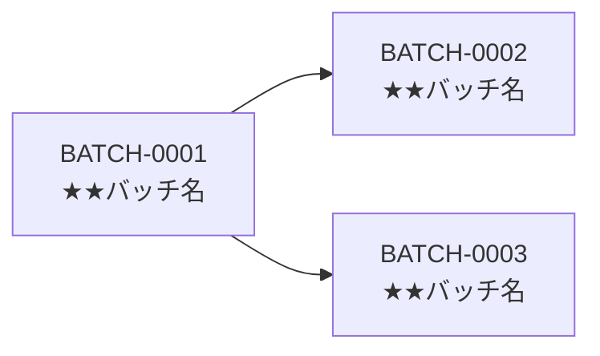

- このドキュメントはジョブスケジュール.mdのテンプレートです。
- ★★または> ★★ で始まる文章とその周辺は、このドキュメントを作成する際の指示文のため、指示として受け止め、最終成果物には残さないでください。

# ジョブスケジュール

---

## ドキュメント情報

> ★★ このドキュメントの管理情報（ID・日付・作成者・承認者）を記入する

| 項目 | 内容 |
|------|------|
| ドキュメントID | BATCH-SCHED-001 |
| プロジェクト名 | ★★プロジェクト名 |
| 作成日 | ★★YYYY-MM-DD |
| 作成者 | ★★氏名 |
| 版数 | 1.0 |
| 承認者 | ★★承認者氏名 |

---

## 実行スケジュール図

> ★★ バッチの実行タイミングをMermaid ganttで図示する。バッチIDはバッチ一覧.mdと対応させること

```mermaid
gantt
    title ジョブスケジュール
    dateFormat HH:mm
    axisFormat %H:%M

    section 日次バッチ
    ★★BATCH-0001 バッチ名 : 02:00, 30m
    ★★BATCH-0002 バッチ名 : 02:30, 20m

    section 月次バッチ
    ★★BATCH-0010 バッチ名 : 01:00, 60m
```

---

## ジョブ依存関係図

> ★★ バッチ間の実行依存関係（先行・後続）をMermaid flowchartで図示する。依存がない場合はこのセクションを削除する

---

## 変更履歴

> ★★ ドキュメントの改版履歴を記録する。初版作成時は版数1.0、変更内容に「初版作成」と記入する

| 版数 | 変更日 | 変更者 | 変更内容 |
|------|--------|--------|---------|
| 1.0 | ★★YYYY-MM-DD | ★★氏名 | 初版作成 |
