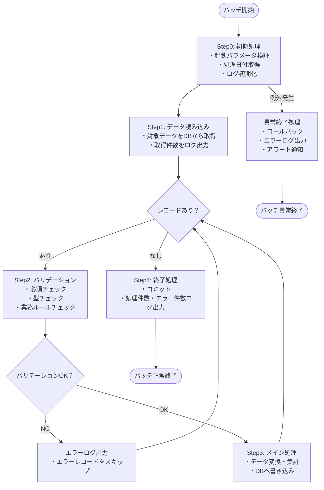
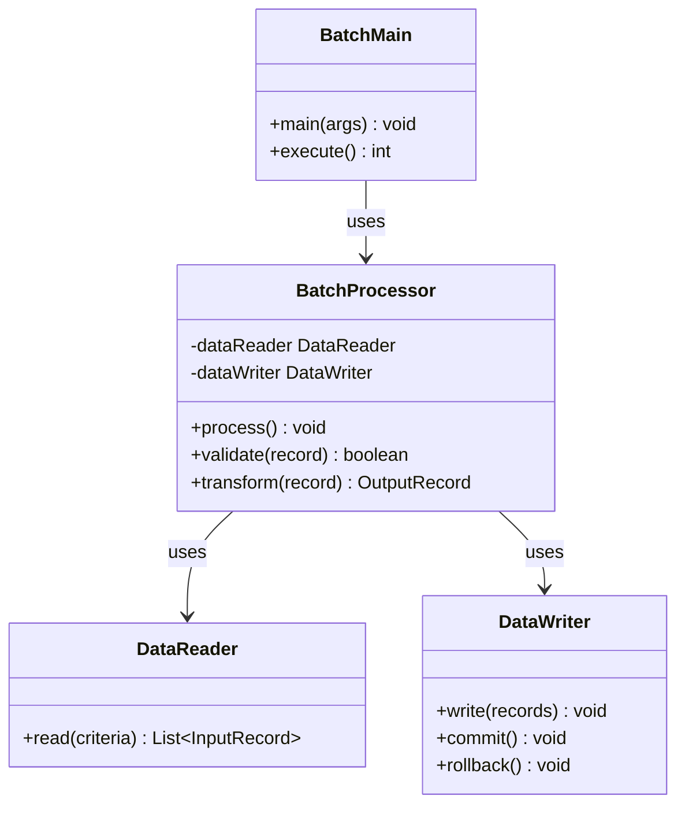

- このドキュメントはバッチ設計書.mdのテンプレートです。
- ★★または> ★★ で始まる文章とその周辺は、このドキュメントを作成する際の指示文のため、指示として受け止め、最終成果物には残さないでください。

# バッチ設計書

---

## ドキュメント情報

> ★★ このドキュメントの管理情報（ID・日付・作成者・承認者）を記入する

| 項目 | 内容 |
|------|------|
| ドキュメントID | BATCH-[連番4桁] |
| 対象バッチ名 | ★★バッチ名（例：受注集計バッチ） |
| 作成日 | ★★YYYY-MM-DD |
| 作成者 | ★★氏名 |
| 版数 | 1.0 |
| 承認者 | ★★承認者氏名 |

---

## バッチ概要

> ★★ バッチの目的・スケジュール・実行環境・想定データ量を定義する

| 項目 | 内容 |
|------|------|
| バッチID | ★★BATCH-XXXX |
| バッチ名 | ★★バッチ名 |
| 目的 | ★★このバッチが実現する業務目的 |
| 実行スケジュール | ★★例：毎日 02:00（cron: 0 2 * * *） |
| 実行環境 | ★★バッチサーバー名 |
| 想定実行時間 | ★★○分以内 |
| 対象データ件数（想定） | ★★通常○件、最大○件 |

---

## 処理フロー

> ★★ バッチ全体の処理フローをMermaid flowchartで図示する



---

## インプット・アウトプット

> ★★ バッチの入出力（DBテーブル・ファイル・ログ）を定義する

### インプット

| # | 種別 | 名称 | 取得元 | 説明 |
|---|------|------|--------|------|
| 1 | DBテーブル | ★★テーブル名 | ★★スキーマ名 | ★★取得条件・対象データの説明 |
| 2 | ファイル | ★★ファイル名 | ★★ファイルパス | ★★ファイル形式・文字コード |

### アウトプット

| # | 種別 | 名称 | 出力先 | 説明 |
|---|------|------|--------|------|
| 1 | DBテーブル | ★★テーブル名 | ★★スキーマ名 | ★★INSERT/UPDATE/DELETE の別と内容 |
| 2 | ファイル | ★★ファイル名 | ★★ファイルパス | ★★ファイル形式・文字コード |
| 3 | ログ | バッチ実行ログ | ★★ログパス | 処理件数・開始/終了時刻・エラー情報 |

---

## クラス構成

> ★★ バッチを構成するクラスの依存関係をMermaid classDiagramで図示する



> ★★ このクラス図全体を実際のバッチクラス構成に置き換える

---

## メソッド詳細定義

> ★★ 主要メソッドの処理詳細・使用クラス/メソッド・使用SQLを記述する

### ★★BatchProcessor.process()

| 項目 | 内容 |
|------|------|
| メソッド名 | process |
| 引数 | なし |
| 戻り値 | void |
| 処理概要 | ★★処理の概要を記述 |

**処理詳細**

| # | 処理内容 | 使用クラス/メソッド | 備考 |
|---|---------|-----------------|------|
| 1 | ★★処理内容（例：対象データを取得する） | ★★DataReader.read() | ★★条件：処理日付が本日のもの |
| 2 | ★★処理内容 | ★★メソッド名 | |

**使用SQL**

```sql
-- ★★処理名（例：対象データ取得）
SELECT
    ★★カラム名
FROM
    ★★テーブル名
WHERE
    ★★条件カラム = ★★条件値
    AND deleted_at IS NULL
ORDER BY
    ★★ソートカラム;
```

---

## エラー処理・例外定義

> ★★ エラー種別ごとの処理内容と、例外クラスごとのリトライ方針を定義する

### エラー処理

| エラー種別 | 発生条件 | 処理内容 | アラート |
|----------|---------|---------|---------|
| ★★DBエラー | ★★DB接続失敗・SQLエラー | ★★ロールバック後に異常終了 | ★★監視システムへ通知 |
| ★★データエラー | ★★必須項目なし・型不正など | ★★スキップ or 異常終了（設計による） | ★★エラーログ出力 |

### 例外クラス定義

| 例外クラス | 発生条件 | 処理内容 | リトライ |
|----------|---------|---------|---------|
| ★★DataAccessException | ★★DB接続エラー・タイムアウト | ★★ロールバック後に異常終了 | ★★3回リトライ後に異常終了 |
| ★★ValidationException | ★★バリデーションエラー | ★★対象レコードをスキップしてログ記録 | なし |

---

## 再実行条件

| 項目 | 内容 |
|------|------|
| 再実行可否 | ★★可能 / 要確認（冪等性あり／なし） |
| 再実行手順 | ★★再実行前に実施すべきこと（例：前回処理データの削除） |

---

## 出力ログ定義

> ★★ バッチが出力するログの種別・タイミング・フォーマットを定義する

| ログ種別 | 出力タイミング | ログ内容 |
|---------|------------|---------|
| INFOログ | バッチ開始時 | `[★★BATCH-XXXX] 処理開始 処理日付:YYYY-MM-DD` |
| INFOログ | バッチ終了時 | `[★★BATCH-XXXX] 処理終了 処理件数:N件 エラー件数:N件` |
| ERRORログ | エラー発生時 | `[★★BATCH-XXXX] エラー発生 レコードID:★★XXX 内容:★★エラーメッセージ` |

---

## 変更履歴

> ★★ ドキュメントの改版履歴を記録する。初版作成時は版数1.0、変更内容に「初版作成」と記入する

| 版数 | 変更日 | 変更者 | 変更内容 |
|------|--------|--------|---------|
| 1.0 | ★★YYYY-MM-DD | ★★氏名 | 初版作成 |
