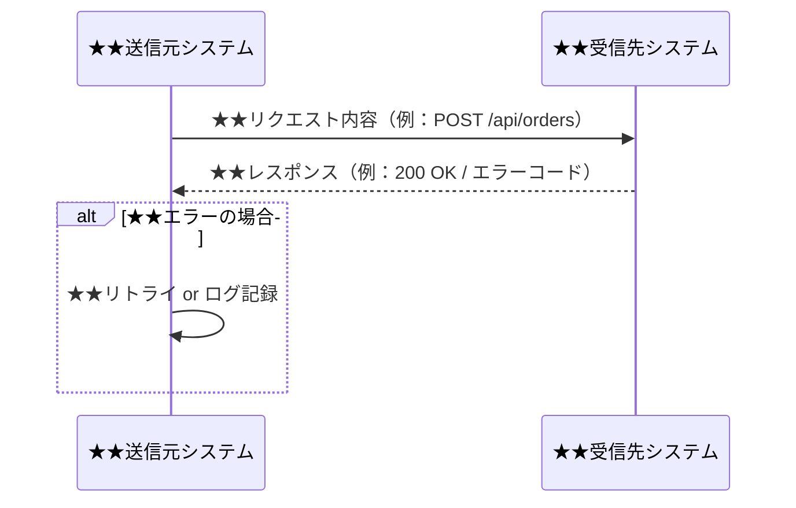

- このドキュメントは外部システム連携設計書.mdのテンプレートです。
- ★★または> ★★ で始まる文章とその周辺は、このドキュメントを作成する際の指示文のため、指示として受け止め、最終成果物には残さないでください。

# 外部システム連携設計書

---

## ドキュメント情報

> ★★ このドキュメントの管理情報（ID・日付・作成者・承認者）を記入する

| 項目 | 内容 |
|------|------|
| ドキュメントID | IF-[連番4桁] |
| インターフェース名 | ★★IF名（例：基幹システム受注連携） |
| 作成日 | ★★YYYY-MM-DD |
| 作成者 | ★★氏名 |
| 最終更新日 | ★★YYYY-MM-DD |
| 版数 | 1.0 |
| 承認者 | ★★双方システム担当者氏名 |

---

## IF一覧

> ★★ すべてのインターフェースをIF-ID・送受信先・連携方式・タイミングで一覧化する

| IF-ID | IF名 | 送信元 | 受信先 | 方式 | タイミング |
|-------|------|--------|--------|------|-----------|
| IF-0001 | ★★IF名 | ★★送信元システム名 | ★★受信先システム名 | ★★REST/SFTP/DB連携等 | ★★リアルタイム/バッチ/日次 |

---

## IF詳細定義

> ★★ IFごとに概要・シーケンス図・リクエスト/レスポンス仕様・エラーコードを定義する

### IF-XXXX：★★インターフェース名

#### 概要

| 項目 | 内容 |
|------|------|
| 目的 | ★★このIFで何を連携するかを記述 |
| 送信元 | ★★送信元システム名・担当部署 |
| 受信先 | ★★受信先システム名・担当部署 |
| 連携方式 | ★★REST API / SFTP / データベース直接連携 など |
| 実行タイミング | ★★リアルタイム（イベント駆動）/ バッチ（日次 03:00）など |
| エラー時の対応 | ★★リトライ回数・アラート通知先・手動対応手順 |

#### シーケンス図

#### リクエスト仕様（送信データ）

| # | 項目名 | 論理名 | データ型 | 必須 | 説明 |
|---|--------|--------|---------|------|------|
| 1 | ★★field_name | ★★論理名 | ★★string/integer/date | ★★必須/任意 | ★★説明 |

#### レスポンス仕様（受信データ）

| # | 項目名 | 論理名 | データ型 | 説明 |
|---|--------|--------|---------|------|
| 1 | ★★field_name | ★★論理名 | ★★string/integer | ★★説明 |

#### エラーコード定義

| エラーコード | HTTPステータス | 意味 | 対処方法 |
|------------|-------------|------|---------|
| ★★ERR-001 | ★★400/404/500等 | ★★エラーの意味 | ★★対処手順 |

---

## 変更履歴

> ★★ ドキュメントの改版履歴を記録する。初版作成時は版数1.0、変更内容に「初版作成」と記入する

| 版数 | 変更日 | 変更者 | 変更内容 |
|------|--------|--------|---------|
| 1.0 | ★★YYYY-MM-DD | ★★氏名 | 初版作成 |
