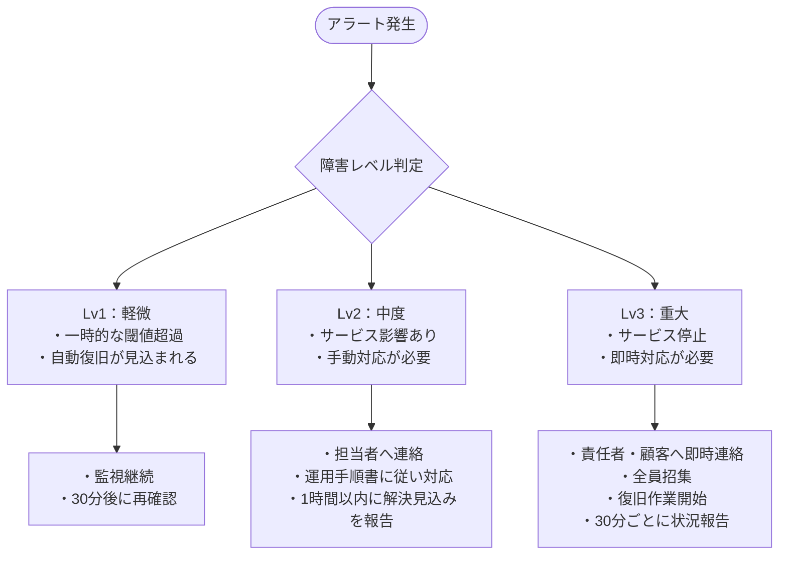

- このドキュメントは運用設計書.mdのテンプレートです。
- ★★または> ★★ で始まる文章とその周辺は、このドキュメントを作成する際の指示文のため、指示として受け止め、最終成果物には残さないでください。

# 運用設計書

---

## ドキュメント情報

> ★★ このドキュメントの管理情報（ID・日付・作成者・承認者）を記入する

| 項目 | 内容 |
|------|------|
| ドキュメントID | OPS-DESIGN-[連番4桁] |
| プロジェクト名 | ★★プロジェクト名 |
| 作成日 | ★★YYYY-MM-DD |
| 作成者 | ★★氏名 |
| 版数 | 1.0 |
| 承認者 | ★★承認者氏名 |

---

## 1. 監視設計

> ★★ 監視項目・閾値・アラート通知先と障害レベルごとの対応フローを定義する

### 監視項目一覧

| 監視ID | 監視対象 | 監視項目 | 閾値（警告） | 閾値（危険） | 監視間隔 | アラート通知先 |
|--------|---------|---------|------------|------------|---------|-------------|
| MON-001 | ★★Webサーバー | CPU使用率 | ★★80% | ★★90% | ★★1分 | ★★通知先 |
| MON-002 | ★★Webサーバー | メモリ使用率 | ★★80% | ★★90% | ★★1分 | ★★通知先 |
| MON-003 | ★★Webサーバー | ディスク使用率 | ★★70% | ★★80% | ★★5分 | ★★通知先 |
| MON-004 | ★★Webサーバー | 死活監視（ping） | - | 応答なし | ★★30秒 | ★★通知先 |
| MON-005 | ★★DBサーバー | 接続数 | ★★最大接続数の70% | ★★最大接続数の90% | ★★1分 | ★★通知先 |
| MON-006 | ★★バッチ | バッチ完了確認 | - | 想定時間の★★150% | バッチ終了時 | ★★通知先 |

### 障害レベル定義と対応フロー

---

## 2. バックアップ設計

> ★★ バックアップ対象・方式・頻度・保管世代・リストア目標時間を定義する

| 対象 | バックアップ方式 | 頻度 | 保管世代 | 保管場所 | リストア目標時間 |
|------|--------------|------|---------|---------|-------------|
| ★★DBフルバックアップ | ★★ダンプ / スナップショット | ★★日次（03:00） | ★★7世代 | ★★バックアップサーバー | ★★2時間以内 |
| ★★DB差分バックアップ | ★★差分 | ★★6時間ごと | ★★4世代 | ★★バックアップサーバー | ★★30分以内 |
| ★★アプリケーションファイル | ★★rsync | ★★日次 | ★★3世代 | ★★バックアップサーバー | ★★1時間以内 |

---

## 3. バッチ実行スケジュール

> ★★ バッチの実行時刻・想定実行時間・依存関係・失敗時対応を一覧化する

| バッチID | バッチ名 | 実行時刻（cron） | 想定実行時間 | 依存バッチ | 失敗時対応 |
|---------|---------|--------------|-----------|---------|---------|
| ★★BATCH-001 | ★★バッチ名 | ★★0 2 * * * | ★★30分以内 | ★★なし / バッチIDXXX | ★★手動再実行 / 翌日スキップ |

---

## 4. 定期運用業務一覧

> ★★ 日次・週次・月次の定期運用業務を担当者・参照手順書とともに一覧化する

| 頻度 | 業務内容 | 担当 | 参照手順書 |
|------|---------|------|---------|
| 日次 | ★★バッチ実行結果確認 | ★★運用担当者 | ★★運用手順書 §○ |
| 日次 | ★★ログ確認（エラーログ） | ★★運用担当者 | ★★運用手順書 §○ |
| 週次 | ★★バックアップ取得確認 | ★★運用担当者 | ★★運用手順書 §○ |
| 月次 | ★★ディスク使用量確認・不要ログ削除 | ★★運用担当者 | ★★運用手順書 §○ |
| 月次 | ★★セキュリティパッチ適用確認 | ★★インフラ担当者 | ★★運用手順書 §○ |

---

## 変更履歴

> ★★ ドキュメントの改版履歴を記録する。初版作成時は版数1.0、変更内容に「初版作成」と記入する

| 版数 | 変更日 | 変更者 | 変更内容 |
|------|--------|--------|---------|
| 1.0 | ★★YYYY-MM-DD | ★★氏名 | 初版作成 |
