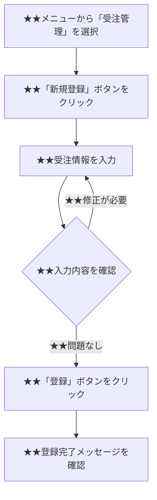

- このドキュメントは操作マニュアル.mdのテンプレートです。
- ★★または> ★★ で始まる文章とその周辺は、このドキュメントを作成する際の指示文のため、指示として受け止め、最終成果物には残さないでください。

# 操作マニュアル

---

## ドキュメント情報

> ★★ このドキュメントの管理情報（ID・日付・作成者・承認者）を記入する

| 項目 | 内容 |
|------|------|
| ドキュメントID | OPM-[連番4桁] |
| 対象機能 | ★★対象機能名（例：受注管理機能） |
| 対象ユーザー | ★★対象ユーザー種別（例：営業担当者） |
| 作成日 | ★★YYYY-MM-DD |
| 作成者 | ★★氏名 |
| 最終更新日 | ★★YYYY-MM-DD |
| 版数 | 1.0 |

---

## はじめに

> ★★ このマニュアルの対象者・目的・前提条件（ブラウザ・権限・事前準備）を記述する

### 本マニュアルの目的

★★このマニュアルで説明する機能の目的と対象者を記述する。

### 前提条件

| 項目 | 内容 |
|------|------|
| 対象システム | ★★システム名・バージョン |
| 対応ブラウザ | ★★Chrome○○以上、Edge○○以上 |
| 必要な権限 | ★★操作に必要なユーザー権限・ロール |
| 事前準備 | ★★マスタ登録等の事前に必要な設定 |

---

## ログイン・ログアウト

> ★★ ログイン・ログアウトの操作手順をステップごとに記述する

### ログイン手順

| ステップ | 操作 | 説明 |
|---------|------|------|
| 1 | ★★URLにアクセスする | ★★ログイン画面のURLを入力する |
| 2 | ★★ユーザーIDを入力する | ★★通知されたユーザーIDを入力する |
| 3 | ★★パスワードを入力する | ★★初回ログイン時はパスワードの変更が求められる |
| 4 | ★★「ログイン」ボタンをクリックする | ★★認証成功後、メニュー画面に遷移する |

### ログアウト手順

| ステップ | 操作 | 説明 |
|---------|------|------|
| 1 | ★★画面右上の「ログアウト」をクリックする | ★★セッションが終了し、ログイン画面に戻る |

---

## ★★機能名（例：受注登録）

### 概要

> ★★ このフェーズの業務目的・背景・関係部門を2〜3文で記述する

★★この機能で何ができるかを2〜3文で記述する。

### 操作手順

| ステップ | 操作 | 説明 | 注意事項 |
|---------|------|------|---------|
| 1 | ★★操作内容 | ★★操作の詳細説明 | ★★注意すべき点（なければ「-」） |
| 2 | ★★操作内容 | ★★操作の詳細説明 | - |
| 3 | ★★操作内容 | ★★操作の詳細説明 | - |

### 入力項目説明

| 項目名 | 必須 | 入力形式・制約 | 例 |
|-------|------|-------------|---|
| ★★項目名（例：顧客名） | 必須／任意 | ★★文字種・桁数制限（例：全角100文字以内） | ★★入力例 |

### エラーメッセージと対処方法

| エラーメッセージ | 発生条件 | 対処方法 |
|--------------|---------|---------|
| ★★エラーメッセージ文言 | ★★このエラーが表示される条件 | ★★ユーザーが取るべき対処方法 |

---

## よくある質問（FAQ）

> ★★ 操作に関するよくある質問と回答を列挙する

| 質問 | 回答 |
|------|------|
| ★★よくある質問内容 | ★★回答内容 |

---

## お問い合わせ先

> ★★ システム障害・操作不明・データ修正依頼の問い合わせ先と対応時間を記述する

| 種別 | 連絡先 | 対応時間 |
|------|-------|---------|
| システム障害・操作不明 | ★★ヘルプデスク連絡先（メール・電話） | ★★平日9:00〜17:00 |
| データ修正依頼 | ★★担当部署・担当者 | ★★対応時間 |

---

## 変更履歴

> ★★ ドキュメントの改版履歴を記録する。初版作成時は版数1.0、変更内容に「初版作成」と記入する

| 版数 | 変更日 | 変更者 | 変更内容 |
|------|--------|--------|---------|
| 1.0 | ★★YYYY-MM-DD | ★★氏名 | 初版作成 |
