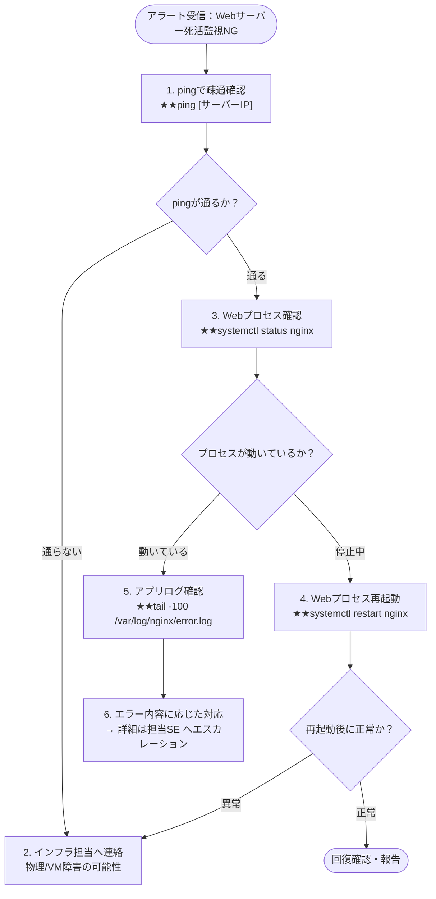

- このドキュメントは運用手順書.mdのテンプレートです。
- ★★または> ★★ で始まる文章とその周辺は、このドキュメントを作成する際の指示文のため、指示として受け止め、最終成果物には残さないでください。

# 運用手順書

---

## ドキュメント情報

> ★★ このドキュメントの管理情報（ID・日付・作成者・承認者）を記入する

| 項目 | 内容 |
|------|------|
| ドキュメントID | OPS-MAN-[連番4桁] |
| プロジェクト名 | ★★プロジェクト名 |
| 作成日 | ★★YYYY-MM-DD |
| 作成者 | ★★氏名 |
| 版数 | 1.0 |

---

## 1. 日次運用手順

> ★★ バッチ実行結果・ログ・バックアップの確認手順をステップごとに記述する

### 1-1. バッチ実行結果確認

**実施タイミング**：毎営業日 ★★09:00

| # | 手順 | コマンド / 確認箇所 | 正常の状態 | 異常時の対応 |
|---|------|-----------------|---------|------------|
| 1 | バッチログを確認する | `★★cat /var/log/batch/YYYYMMDD.log` | `[INFO] 処理終了` で終わっていること | §4 障害対応手順へ |
| 2 | バッチ処理件数を確認する | ★★ログ内の処理件数を確認 | ★★前日比±○%以内であること | ★★担当者へ連絡 |
| 3 | エラーログを確認する | `★★grep ERROR /var/log/app/YYYYMMDD.log` | エラーが0件であること | §4 障害対応手順へ |

### 1-2. バックアップ取得確認（週次）

**実施タイミング**：毎週月曜日 ★★10:00

| # | 手順 | 確認方法 | 正常の状態 |
|---|------|---------|---------|
| 1 | バックアップファイルの存在確認 | `★★ls -la /backup/db/` | ★★直近7日分のファイルが存在すること |
| 2 | バックアップファイルのサイズ確認 | `★★du -sh /backup/db/*.dump` | ★★前週比±30%以内であること |

---

## 2. 障害対応手順

> ★★ 障害種別ごとの対応フロー・コマンド・確認内容をMermaidフローチャートと手順表で記述する

### 2-1. Webサーバー応答なし

### 2-2. DBサーバー接続不可

| # | 手順 | コマンド | 確認内容 |
|---|------|---------|---------|
| 1 | DBプロセス確認 | `★★systemctl status postgresql` | プロセスが起動しているか |
| 2 | DBログ確認 | `★★tail -100 /var/log/postgresql/postgresql.log` | エラーメッセージの確認 |
| 3 | DB再起動（判断後） | `★★systemctl restart postgresql` | 再起動の可否はDB担当が判断 |

---

## 3. リストア手順

> ★★ DBリストアの実施条件・手順・確認コマンドを記述する。必ず責任者承認を得てから実施する

### 3-1. DBリストア

> **注意**：リストアは本番DBの全データが上書きされる。必ず責任者の承認を得てから実施すること。

| # | 手順 | コマンド |
|---|------|---------|
| 1 | リストア対象のバックアップファイルを確認する | `★★ls -la /backup/db/` |
| 2 | DBサービスを停止する | `★★systemctl stop postgresql` |
| 3 | リストアを実行する | `★★pg_restore -U postgres -d ★★DB名 /backup/db/★★ファイル名` |
| 4 | DBサービスを起動する | `★★systemctl start postgresql` |
| 5 | データを確認する | `★★psql -U postgres -c "SELECT COUNT(*) FROM ★★主要テーブル名;"` |

---

## 4. 緊急連絡先

> ★★ システム障害・インフラ障害・エスカレーション先の連絡先と対応時間を記述する

| 役割 | 氏名 | 連絡先 | 対応時間 |
|------|------|--------|---------|
| ★★システム担当 | ★★氏名 | ★★連絡先（秘密管理ツール参照） | ★★平日 9:00-18:00 |
| ★★インフラ担当 | ★★氏名 | ★★連絡先（秘密管理ツール参照） | ★★24時間365日 |
| ★★エスカレーション先（PM） | ★★氏名 | ★★連絡先（秘密管理ツール参照） | ★★平日 9:00-20:00 |

---

## 変更履歴

> ★★ ドキュメントの改版履歴を記録する。初版作成時は版数1.0、変更内容に「初版作成」と記入する

| 版数 | 変更日 | 変更者 | 変更内容 |
|------|--------|--------|---------|
| 1.0 | ★★YYYY-MM-DD | ★★氏名 | 初版作成 |
